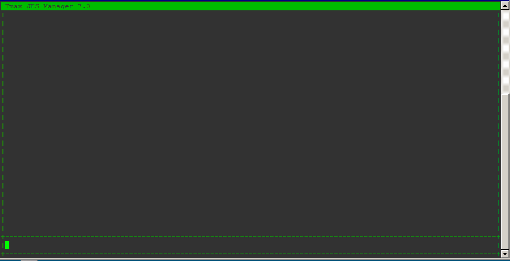
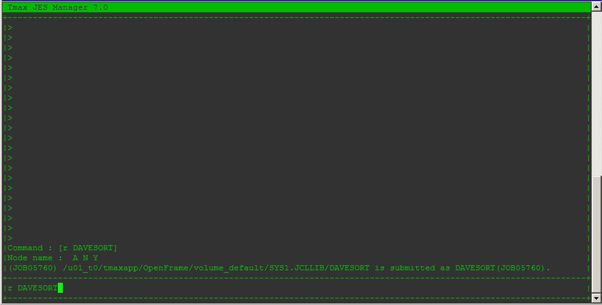
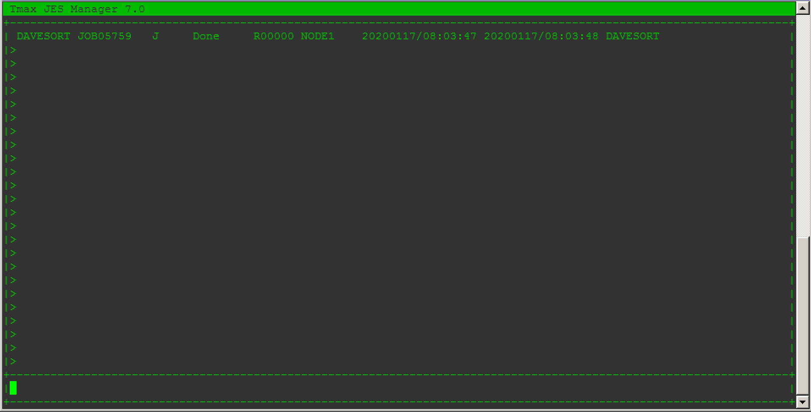
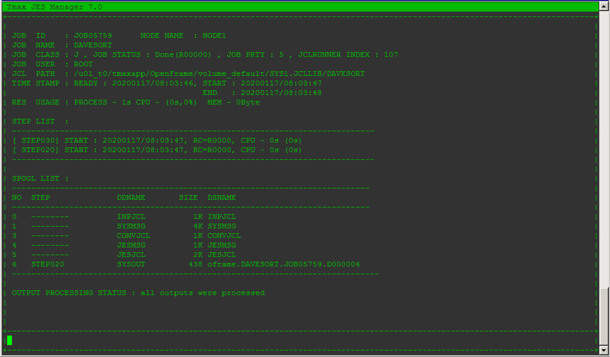
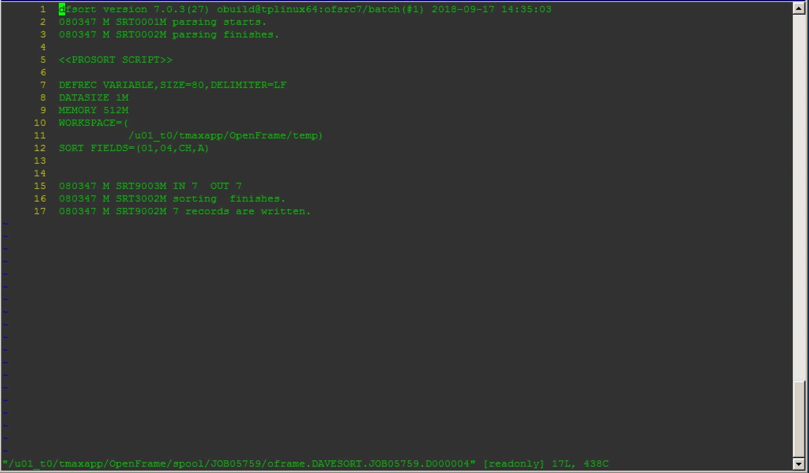

# How To Use TJESMGR

Tjesmgr stands for TJES (Tmax Job Entry System) Manager.

The following actions can be done through Tjesmgr:

| COMMAND     | DESCRIPTION                                                                                                              |
|-------------|--------------------------------------------------------------------------------------------------------------------------|
| RUN | R     | Submit a Batch Job                                                                                                       |
| PS          | Lists information for jobs in the JOBQ filtered by JOB variables such as JOBNAME, JOBID, CLASS, STATUS, RC, NODE, or JCL |
| PSJOB | PSJ | Prints detailed information of a specific JOB ID                                                                         |
| PODD        | Opens the spool of the dd-index or dd-name                                                                               |

There are many more commands which can be found in the TJES Guide provided by TmaxSoft, but for general and quick usage of Tjesmgr, these are the main commands you should be familiar with.


## General

To open Tjesmgr, execute the command ```tjesmgr```. You should see the following screen:



## RUN

Once you open ```tjesmgr``` you can submit a job by issuing the RUN command.



Note that if you do not specify a full path, tjesmgr will execute the jobs in order of priority based on the PROCLIB priority set in the tjes.conf configuration file which can be found in $OPENFRAME_HOME/config/tjes.conf

## PS

Once you submit a JOB, you can check all of the jobs by issuing the ```PS``` command. You can press ```<ENTER>``` to go down a page. The latest submitted job will be at the bottom. You can also pass additional information through the ```PS``` command to narrow down the search. For example, you can pass the JOB Name. 

Example:

```
tjesmgr ps n=DAVESORT
```



## PSJ

Once you have submitted the job, you can find the JOBCARD information by issuing the ```PSJ``` command. This will allow you to see information such as:

* JOB ID
* NODE Name
* JOB Name
* JOB Class
* JOB Status (Return Code)
* User that submitted the JOB
* Step List & Max Return Code for Each Step
* Spool List



## PODD

Once you are on the above screen, you can check spool output. Tjesmgr will assign a number for each DD so that you can query it. Based on the previous image, we can see that the SYSOUT is assigned to No. 6

To view it, issue the following command from the previous screen:

```
podd @J di=6
```

If you already know the JOB and the assigned spool number, you can substitute ```@J``` for a JOBID.



