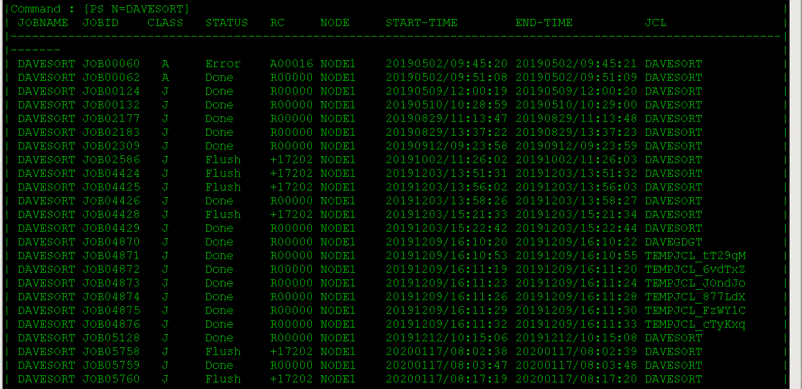
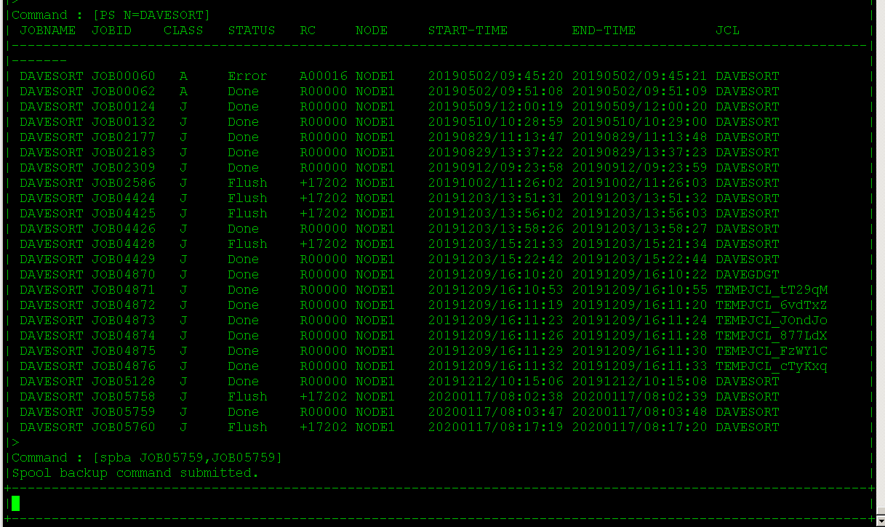
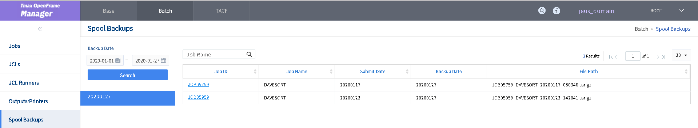
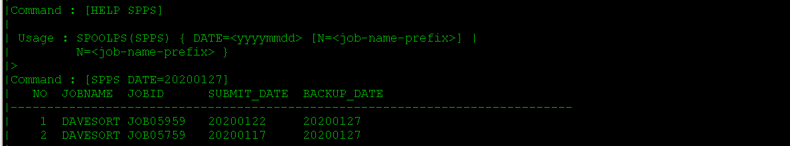
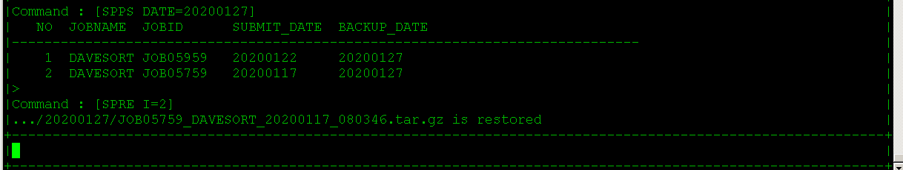
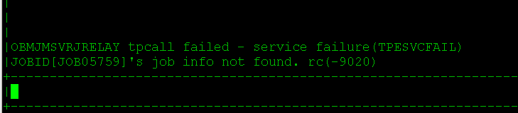

# OpenFrame Spool Backup and Spool Restore

For more information on Spool Backup and Spool Restore procedures, please consult this guide in addition to the manuals. All of the following section numbers are based on the TJES Guide version 2.1.6. You can find information on:

- Spool Backup (SPBA) in section 6.6.1 on page 107
- Spool PS (SPPS) in section 6.6.8 on page 110
- Spool Restore (SPRE) in section 6.6.11 on page 112

# Spool Backup

Use the ```tjesmgr``` command spoolbackup ```spba``` and pass a range of JOBID numbers. If you want to backup a single JOB, specify both min and max range as the same number. This can be useful if you are very close to hitting the limit of storage on the Linux Server. Unfortunately, at this time, you are unable to backup spools through OFManager, however, you will be able to view the backed up spools in the Batch section of OFManager under the Spool Backup tab on the left side of the screen. 

## Usage

The following command will backup JOB12345.

```bash
tjesmgr SPBA JOB12345,JOB12345
```

## Step By Step Example

1. First, open Tmax Job Entry Subsystem Manager (```tjesmgr```) using the self named command ```tjesmgr```

2. Search for the JOB by Name, in this case, we are using a test job called DAVESORT



3. Here, we can see that JOB05759 is the latest DAVESORT JOB. Let's take a backup of this spool. To do this, issue the command:

```bash
SPBA JOB05759,JOB05757
```



4. You have successfully backed up the spool. You can see it in putty by navigating to ```$OPENFRAME_HOME/spbackup/${date}``` where the ```${date}``` is the date that you ran the SPBA command.

5. If you go into the ```$OPENFRAME_HOME/spbackup/${date}``` directory, you will see the compressed spool. 

6. You can also see the backed up spool via OFManager. 

	1. Login to OFManager

	2. Click Batch tab at the top

	3. Click Spool Backups on the left side of screen

	4. Enter a date range for when you took the backups

	5. Click on the date where you took the backups

	6. See spools to the right



# Spool Restore

To restore a spool, you must have already completed a spool backup. We will go over how we can see which spools we are able to restore, and then restore them.

## Usage

The following commands must be used in conjunction with one another:

```bash
tjesmgr SPPS DATE=${date}
tjesmgr SPRE I=${num}
```

The ${date} you pass must be in the format yyyymmdd and the ${num} passed in the SPRE command must be from the output of SPPS. You will see an example below

## Step by Step Example

1. View available spools to unpack using ```SPPS``` command inside of ```tjesmgr```. You can also say ```HELP SPPS``` to get more information on how to correctly use the ```SPPS``` command. In general, you can use the help to gain more information on ANY ```tjesmgr``` command.

```bash
SPPS DATE=${date}
```

Where ${date} is in the format yyyymmdd



2. Here, we can see that JOB05759, the job we are interested in, is indexed as number 2 in this list. We need to use ```SPRE``` and pass index number 2. It's important to note that you must use ```SPRE``` command directly _*after*_ the ```SPPS``` command, so that ```tjesmgr``` understands why you are passing that index number. To say ```SPRE I=2``` at a random time in tjesmgr will yield an error.

```bash
SPPS DATE=${date}
SPRE I=2
```



3. Now you can see the unpacked spool in $OPENFRAME_HOME/spunpack directory

4. Note that JOB05759 is now freed from ```tjesmgr```. We can no longer view this spool in ```tjesmgr```


