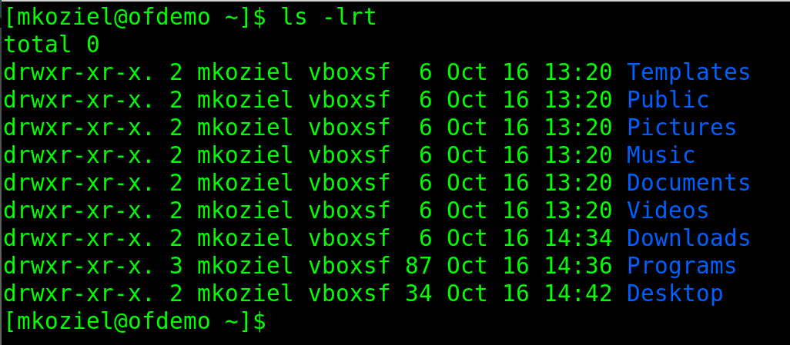

# Linux Commands Cheat Sheet

# Table of Contents

- [ls - List Files and Directories](#1-ls-list-files-and-directories)
	- [ls - Basic Usage](#example-11-basic-usage-ls)
	- [ls - Long Listing](#example-12-long-listing-ls--l)
	- [ls - Long Listing Time Based Reverse Order](#example-13-long-listing-based-on-time-and-reversed)

## 1. ls (List Files and Directories)

**Description:** This command displays the files and directories located inside the directory you are currently in. You can add additional options to increase the amount of information displayed.

### Example 1.1) Basic Usage (ls)
```bash
ls
```


### Example 1.2) Long Listing (ls -l)

Adding ```-l``` to the command will create a Long Listing. By using the ```-l``` option, you can see additional information such as; permissions, link count, owner of the file/directory, group of the file/directory, size in bytes, and date and time that the file/directory was last modified.

```bash
ls -l
```


### Example 1.3) Long Listing based on time and reversed

This is a really useful way of listing files in a directory, because the latest modified file or directory will be directly above the command you just issued, making it very quick and easy to find the file you were just working on.

```-t``` means list based on time
```-r``` means list in reverse order

```bash
ls -lrt
```

