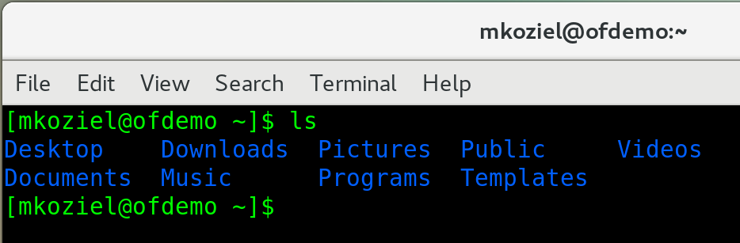

# Linux Commands Cheat Sheet

# Table of Contents

## 1. ls (List Files and Directories)

**Description:** This command displays the files and directories located inside the directory you are currently in. You can add additional options to increase the amount of information displayed.

**Basic Command:**
```bash
ls
```

### Example 1. Basic Usage (ls)



### Example 2. Long Listing (ls -l)

