# OpenFrame Installation Guide

## Table of Contents

- [1. Overview](#overview)
- [2. OpenFrame Installation](#openframe-installation)
  * [2.1 Pre-installation](#pre-installation)
    - [2.1.1 Set Hostname](#set-hostname)
    - [2.1.2 Create groups and users](#create-groups-and-users)
    - [2.1.3 Create directory structure](#create-directory-structure)
    - [2.1.4 Download licenses](#download-licenses)
    - [2.1.5 Copy all the files](#copy-all-the-files)
    - [2.1.6 Update kernel parameters](#update-kernel-parameters)
    - [2.1.7 Network configuration](#network-configuration)
    - [2.1.8 Install required packages](#install-required-packages)
    - [2.1.9 Setup NTP](#setup-ntp)
    - [2.1.10 Update bash profiles](#update-bash-profiles)
  * [2.2 Install Tibero for OpenFrame](#isntall-tibero-for-openframe)
    - [2.2.1 Scenario type](#scenario-type)
    - [2.2.2 Installation first steps](#installation-first-steps)
    - [2.2.3 Generate the TIP file](#generate-the-tip-file)
    - [2.2.4 Client configuration file](#client-configuration-file)
    - [2.2.5 Final installation and verification steps (SCENARIO A ONLY)](#final-installation-and-verification-steps-scenario-A)
    - [2.2.6 Final installation and verification steps (SCENARIO B ONLY)](#final-installation-and-verification-steps-scenario-B)
  * [2.3 Creating an ODBC Environment](#creating-an-odbc-environment)
    - [2.3.1 Installation](#installation)
    - [2.3.2 Verification steps](#verification-steps)
  * [2.4 Base](#base)
    - [2.4.1 Installation](#installation)
    - [2.4.2 Verification steps](#verification-steps)
  * [2.5 Install Batch](#install-batch)
    - [2.5.1 Installation](#installation)
    - [2.5.2 Verification steps](#verification-steps)
    - [2.5.3 Script editing](#script-editing)
  * [2.6 Install TACF](#install-tacf)
    - [2.6.1 Installation](#installation)
    - [2.6.2 Verification steps](#verification-steps)
  * [2.7 Install ProSort](#install-prosort)
    - [2.7.1 Installation](#installation)
    - [2.7.2 Verification steps](#verification-steps)
  * [2.8 Install ProTrieve](#install-protrieve)
    - [2.8.1 Installation](#installation)
    - [2.8.2 Verification steps](#verification-steps)
  * [2.9 Install OFCOBOL](#install-ofcobol)
    - [2.9.1 Installation](#installation)
    - [2.9.2 Verification steps](#verification-steps)
  * [2.10 Install OFPLI](#install-ofpli)
    - [2.10.1 Installation](#installation)
    - [2.10.2 Verification steps](#verification-steps)
  * [2.11 Install OFASM](#install-ofasm)
    - [2.11.1 Installation](#installation)
    - [2.11.2 Verification steps](#verification-steps)
  * [2.12 Install OSC](#install-osc)
    - [2.12.1 Installation](#installation)
    - [2.12.2 Verification steps](#verification-steps)
  * [2.13 JEUS](#jeus)
    - [2.13.1 Ant-Apache](#ant-apache)
    - [2.13.1 Installation](#installation)
    - [2.13.3 Duplication through the JEUS 7 webadmin](#duplication-through-the-jeus-7-webadmin)
    - [2.13.4 Duplication through the jeusadmin console](#duplication-through-the-jeusadmin-console)     
  * [2.14 Install OFGW](#install-ofgw)
    - [2.14.1 Installation](#installation)
    - [2.14.2 Verification steps](#verification-steps)
  * [2.15 Install OFManager](#install-ofmanager)
    - [2.15.1 Installation](#installation)
    - [2.15.2 Verification steps](#verification-steps)
  * [2.16 Install OFMiner](#install-ofminer)
    - [2.16.1 Installation](#installation)
    - [2.16.2 Verification steps](#verification-steps)
  * [2.17 Install HiDB](#install-hidb)
    - [2.17.1 Installation](#installation)
    - [2.17.2 Verification steps](#verification-steps)
  * [2.18 Install OSI](#install-osi)
    - [2.18.1 Installation](#installation)
    - [2.18.2 Verification steps](#verification-steps)
  * [2.19 Install OFStudio](#install-ofstudio)
    - [2.19.1 Server Installation](#server-installation)
    - [2.19.2 Verification steps](#verification-steps)
    - [2.19.3 Client Installation](#client-installation)


# 1. Overview
This document is intended to go through the installation of Tibero and OpenFrame. For information listed below, please refer to the installation package document related to your situation:
- Version list (version of the software supposed to be installed)
- File list (list of binaries, TAR archives, scripts required for installation)
- Operating system characteristics (where OpenFrame is going to be installed)
- Hardware
- Software requirements
- Additional information if required

Each time you use this guide to install OpenFrame on an OS that is not already listed, please create a installation package guide for this specific OS. As a template you can take any installation package guide already available.

# 2. OpenFrame installation
TODO Try another install applying that rule: use symbolic links (ln -s) over cp commands for licenses every time it is possible in order to have one folder with licenses only.
TODO Remove all unnecessary steps to put it in the general installation FAQ

If you have any question during the installation process, please refer to the installation FAQ document. If there is no answer to your problem in this document, ...
TODO Add what the user is supposed to do in this situation (raise an issue, create a ticket, send a email to the maintenance team...)

## 2.1 Pre-installation

#### 2.1.1 Set Hostname
__a.__ Login as root and check hostname. For the simplicity of the demo, change hostname to ofdemo (case sensitive, be careful it has to be __ofdemo__):
```bash
su -
# <enter root password>
hostname # Just to check the default hostname
hostnamectl set-hostname ofdemo
```

__b.__ Modify the file _/etc/hosts_ with _vi_:

Add the following line to the end of the file (replace 0.0.0.0 with the IP of the VM):
```text
0.0.0.0 ofdemo ofdemo
```


_note: On cloud VMs, the private IP should be used._

The private IP can be found with the following command under _eth0_ (it could also be _wlp0s3_ or _enp0s3_ or _ens192_ depending on your machine): `ifconfig -a`

__c.__ Check the _/etc/hostname_ file to see if changes took effect:
```bash
cat /etc/hostname
# After checking, please reboot
reboot
```
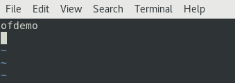

__Verification step.__ Run the following command to see if the changes took effect: `hostname`

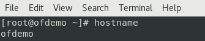

_note: If not set already, set root user password with the command "passwd root". As seen in the installation package, use preferably `tmax1234` as the password._

#### 2.1.2 Create groups and users
__a.__ Login as root and enter the following commands in the terminal window:
```bash
su -
# <enter root password>
groupadd mqm -g 10000
groupadd dba -g 10005

useradd -d /home/oframe -g mqm -s /bin/bash -m oframe -u 10001
useradd -d /home/oftibr -g dba -s /bin/bash -m oftibr -u 10002
```

__b.__ Set passwords for the new users, choose “__tmax1234__” (without the quotes):
```bash
passwd oframe
passwd oftibr
```
_note: Type the passwords two times because it fails the dictionary check (too simple)._

#### 2.1.3 Create directory structure
TmaxSoft suggests creating your directory structure in the following way. Create an opt directory in root directory (if this one does not exist already). Once you have the directory, create the tmaxapp, tmaxdb, tmaxsw, tmaxui directories:
```bash
su -
# <enter root password>
cd /
mkdir opt
cd opt
mkdir tmaxapp tmaxdb tmaxsw tmaxui
```

#### 2.1.4 Download licenses
All licenses for OpenFrame depend on the __hostname__ and the __number of cores__ (remember how many CPU cores you choose for your VM), and can last from 2 months to 6 months depending on the license.
To get the latest licenses specific to your machine, download them from TmaxSoft Technet website.

_note: If you don't remember the NCPU value, run the command `lscpu | grep 'CPU(s)'` and read the first output line._

- Access Technet at <https://technet.tmaxsoft.com/>
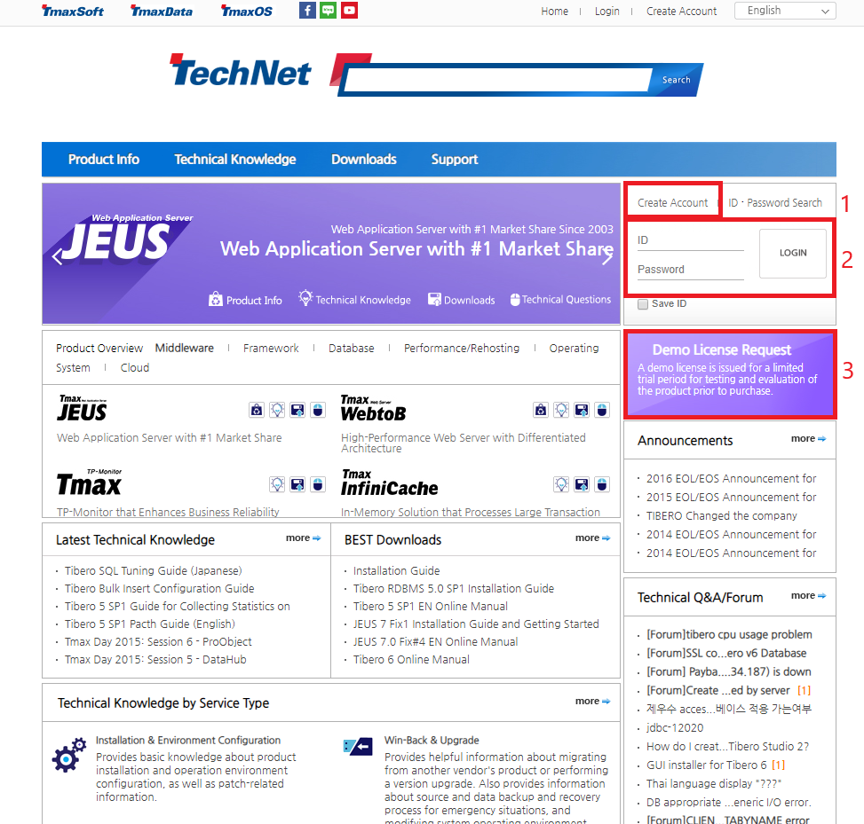

- Login to your account, and click Demo License Request. If you don't have an account yet, you should create one. Please provide an email address that you regularly check, licenses will be sent to this address:


- Now, click on License Demo Request:


- Here is a list of al licenses you need for this installation:
  - Tmax
  - JEUS, 5fix#19later
  - Tibero 6.0 Standard Edition
  - OpenFrame Engine with all modules selected (BASE, BATCH, TACF, OSC, OSI, OSD, AIM, HIDB, NDB2)
  - OpenFrame Compiler OFCOBOL then OFPLI
  - OpenFrame Tool
    - Protrieve
    - ProSort 2.0
    - OpenFrame GW with WebTerminal (ncpu=4, still related to the number of cpu you have for your machine)
    - OpenFrame Miner (ncpu=4)
    - OpenFrame Manager with Batch, TACF and Online (ncpu=4)

For "Host Name", put __ofdemo__ and for "Purpose of Use" put __demo__.

##### _note: Please DO NOT rename license files._

#### 2.1.5 Copy all the files

__a.__	Save all the required licenses on your host machine. In my case, I create a _licenses_ folder in my shared folder with the VM. Create an additional folder _prosort_ for the prosort license and an _openframe_ folder for the following licenses: licbase.dat, lichidb.dat, licofcob.dat, licofpli.dat, licosc.dat, licosi.dat, lictacf.dat, lictjes.dat. I also created a _binaries_ folder before to put all the binaries and scripts required for OpenFrame installation.

__b.__ Copy the licenses to the directory _/opt/tmaxsw/licenses_ and the binaries to _/opt/tmaxsw/_:
```bash
su -
# <enter root password>
cd /opt/tmaxsw
cp -R /media/sf_Share_VMs/binaries/* .
cp -R /media/sf_Share_VMs/licenses/ .
cp -R /media/sf_Share_VMs/scripts/ .
```

__c.__ oframe will take ownership of tmaxapp, tmaxsw, and tmaxui while oftibr will take ownership of tmaxdb:
```bash
cd /opt
chown -R oftibr:dba tmaxdb
chown -R oframe:mqm tmaxapp tmaxsw tmaxui
```


#### 2.1.6 Update kernel parameters
__a.__ Modify the file _/etc/sysctl.conf_ with _vi_ as follow:
```text
# Shared Memory
kernel.shmmni = 4096
kernel.shmmax = 4294967295
kernel.shmall = 2097152
kernel.sem = 10000 32000 10000 10000

fs.file-max = 65536
net.ipv4.ip_local_port_range = 1024 65000

net.core.rmem_default=262144
net.core.wmem_default=262144
net.core.rmem_max=262144
net.core.wmem_max=262144
```

__b.__ Refresh the kernel parameters dynamically without a reboot: `sysctl -p`

__c.__ Edit the kernel limits in _/etc/security/limits.conf_ with _vi_. This file allows setting resource limits for users logged in via PAM. This is a useful way of preventing, for example, fork-bombs from using up all system resources. Add the lines below to the end of the file:
```text
oframe          soft    nofile          65536
oframe          hard    nofile          65536
oframe          soft    nproc           unlimited
oframe          hard    nproc           unlimited
oframe          soft    core            unlimited
oframe          hard    core            unlimited

oftibr           soft    nofile          1024
oftibr           hard    nofile          65536
oftibr           soft    nproc           2047
oftibr           hard    nproc           16384
```

#### 2.1.7 Network configuration
__a.__ Edit the interface configuration file and make the IP address which you are provided with static.
Modify the file _/etc/sysconfig/network-scripts/*name_of_the_network_interface_on_your_machine*_ with _vi_ as follow:

```text
TYPE=Ethernet
PROXY_METHOD=none
BOOTPROTO=static
DEFROUTE=yes
IPV4_FAILURE_FATAL=no
IPV6INIT=yes
IPV6_AUTOCONF=yes
IPV6_DEFROUTE=yes
IPV4_FAILURE_FATAL=no
IPV6_ADDR_GEN_MODE=stable-privacy
DEVICE="enp0s3"
ONBOOT=yes
IPADDR=0.0.0.0
NETMASK=0.0.0.0
GATEWAY=0.0.0.0
DNS1=0.0.0.0
DNS2=0.0.0.0
PREFIX=24
```
- BOOTPROTO value "dhcp" to "static"
- Add the lines missing
- Modify IPADDR, NETMASK, GATEWAY, DNS1,  DNS2, with your values

_note: You can retrieve the gateway address with the command: `route -n` or `ip route` show or even with `netstat -rn`. You can retrieve DNS addresses with the commands: `cat etc/resolv.conf` or `nmcli dev show | grep DNS`_

__b.__ Restart the network on the VM with the following command:
```bash
systemctl restart network
```

__c.__ Open the file _/etc/resolv.conf_ with _vi_ and add the following line:
```text
nameserver 9.9.9.9
```
This command setup Quad9 DNS on Linux. Quad9 is a DNS that brings together cyber threat intelligence about malicious domains from variety of public and private sources and blocks access to those malicious domains when your system attempts to contact them.

#### 2.1.8 Install required packages
__a.__ List the installed OpenJDK packages:
```bash
rpm -qa | grep openjdk
```
Then, remove all of them:
```bash
yum remove ...
```
Check again with the list command above that you remove all the packages.

__b.__ Install the appropriate JDK package, run the following commands:
```bash
cd /opt/tmaxsw
rpm -ivh jdk-7u79-linux-x64.rpm
```

```bash
yum install -y dos2unix glibc glibc.i686 glibc.x86_64 libaio gcc gcc-c++ strace ltrace gdb nano vim-enhanced git htop
yum install -y compat-libtermcap # See specific installation below depending on your OS
# TODO Is the following package necessary?
yum install -y ntp

# If REDHAT Solaris try below
yum install glibc-2.17-78.el7.i686

# If Centos try below instead of compat-libtermcap (deprecated)
yum install -y ncurses*
ln -s /usr/lib64/libncurses.so.5.9 /usr/lib/libtermcap.so
ln -s /usr/lib64/libncurses.so.5.9 /usr/lib/libtermcap.so.2

#If SUSE (SLES) is used, try below instead of compat-libtermcap
ln -s /user/lib64/libncurses++.so.5.9 /user/lib/libtermcap.so
ln -s /user/lib64/libncurses++.so.5.9 /user/lib/libtermcap.so.2
```

If you did not installed the ntp package, skip the following section

#### 2.1.9 Setup NTP
NTP (Network Time Protocol) is a protocol to keep servers time synchronized: one or several master servers provide time to client servers that can themselves provide time to other client servers (notion of stratus).

- Activate at boot and start the NTPD service:
```bash
systemctl enable ntpd
systemctl start ntpd
```

#### 2.1.10 Update bash profiles
Create or modify the following bash profiles:

- __oframe user__
Login as oframe and go to the _~/_ directory to create or modify the file with _vi_. You can use the bash_profile provided in your installation package, just copy/paste it and override the existing one.

- __oftibr user__
Login as oftibr and go to the _~/_ directory to create or modify the file with _vi_. You can use the bash_profile provided in your installation package, just copy/paste it and override the existing one.

Every time you make any change to one of the bash profiles, log out/log in or execute it with the command: `. ~/.bash_profile` or `source ~/.bash_profile`. If you use multiple terminals with oframe or oftibr user, make sure to execute the bash profile in each of them.

## 2.2 Install Tibero for OpenFrame

#### 2.2.1 Scenario type
If you want to install OpenFrame and Tibero on two different servers, you would need to install Tibero client/OpenFrame on one server, and Tibero client + server on the other server.

The two scenarios are depicted here:


Make sure the two Tibero binaries installed on the separate servers are identical. This would also mean that if you patch a Tibero on one server, you would also need to patch the other.

#### 2.2.2 Installation first steps
__a.__ Unpack tibero6 from the tar.gz file using the following commands:
```bash
# Make sure you logged in as oftibr, if not run the following line first
su - oftibr
# <enter password>
cd /opt/tmaxdb
# The following cp commands probably need root access because the owner of the
# /opt/tmaxsw/ folder is not oftibr but oframe.
# Moreover, copying does not change the owner of the file. Please change the
# owner to oftibr instead of oframe with chown command
su -
# <enter root password>
cp /opt/tmaxsw/tibero6-bin-FS06_CS_1806-linux64-158667-opt-20180912120346-tested.tar.gz .
chown oftibr:dba tibero6-bin-FS06_CS_1806-linux64-158667-opt-20180912120346-tested.tar.gz .
exit
tar -xzvf tibero6-bin-FS06_CS_1806-linux64-158667-opt-20180912120346-tested.tar.gz
```

__b.__ You should now see a tibero6 directory in _/opt/tmaxdb_:
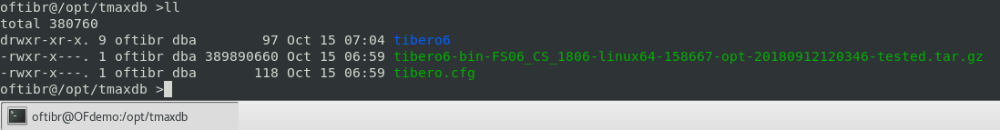

__b.__ Copy the license downloaded before to the license directory:
```bash
# Same issue as above, you probably need to use root access and change the owner
# of the license file
cp /opt/tmaxsw/licenses/license.xml /opt/tmaxdb/tibero6/license/license.xml
```

#### 2.2.3 Generate the TIP file
In case you are in scenario B, configuration changes need to be applied on OF + Tibero client server.

The TIP file is the Tibero instance folder. It contains parameters used by the database server. Inside the _config_ folder, there will be a _gen_tip.sh_ script. Run the script using the below commands:
```bash
cd /opt/tmaxdb/tibeor6/config
sh gen_tip.sh
```

Then open the file _TVSAM.tip_ with _vi_ and modify the __MAX_SESSION_COUNT__ to __120__ instead of __20__, the __TOTAL_SHM_SIZE__ to __1G__ instead of __2G__, and the __MEMORY_TARGET__ to __2G__ instead of __4G__ (these values are related to your OS and its configuration). You also need to add the below parameters:
```text
WTHR_PROC_CNT=8
_WTHR_PER_PROC=15
_STMT_DD_CSR_MODE=N
```
You should have the same file as the screenshot below:
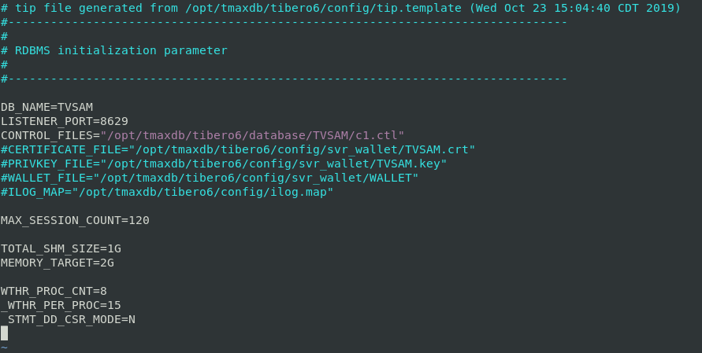

#### 2.2.4 Client configuration file
Modify the Tibero client configuration file located at _$TB_HOME/client/config/tbdsn.tbr_ as shown below (local install example). For local install, you might be using 127.0.0.1 or localhost but in remote install you need to specify the remote IP address or hostname. There are no modification to _tdbsn.tbr_ in the scenario A.


#### 2.2.5 Final installation and verification steps (SCENARIO A ONLY)
__a.__	Delete the existing default database instances (BE CAREFUL ONLY DO THIS IF YOU ARE SURE):
```bash
# Probably useless, the TVSAM folder doesn't exist for the first installation
rm -rf /opt/tmaxdb/tibero6/TVSAM
```

__b.__	Create a new database instance:
```bash
cd /opt/tmaxdb/tibero6/bin
sh tb_create_db.sh
```

__c.__	Test shutdown/startup commands and verify that Tibero processes are running:
```bash
tbdown
tbboot
# When Tibero is down, you can run the command "tbdown clean" to delete the info file

# This first command shows information on the inter-process communication facilities
# for which the calling process has read access. By default, it shows information
# about all three resources: shared memory segments, message queues, and semaphore
# arrays.
ipcs -m | grep oftibr

ps -ef | grep tbsvr
```
Output for the last command:


Now that we have a database created, both of our users have their updated bash profiles ready, we can create the tablespaces for the OpenFrame application. The script _dbclear.sh_ contains the necessary drop and create statements.

__d.__ Copy the script _dbclear.sh_ and run it:
```bash
# Same issue as in couple sections above, you probably need to use root access
# and change the owner of the script file because you need to run it as oftibr
su -
# <enter root password>
cp /opt/tmaxsw/scripts/tibero/dbclear.sh /opt/tmaxdb/tibero6/
chown oftibr:dba /opt/tmaxdb/tibero6/bin/dbclear.sh
exit
cd /opt/tmaxdb/tibero6/bin
sh dbclear.sh
```

__e.__ Try to log in the database with the command: `tbsql tibero/tmax` (or `tbsql sys/tibero` but this is the admin of the database). Then enter the same command as below on the screenshot to see if you obtain the same output:


##### _note: Please DO NOT shut down Tibero at the end of the installation. TIBERO SHOULD BE UP FOR THE FOLLOWING INSTALLATIONS TO CONTINUE._

#### 2.2.6 Final installation and verification steps (SCENARIO B ONLY)
TODO This section is untested, it should be tested to check if everything is ok

__a.__	Copy the script _dbclear.sh_:
```bash
# Make sure you still logged in as oftibr, if not run the following line first
su - oftibr
# <enter password>
# Same issue as in couple sections above, you probably need to use root access
# and change the owner of the script file
cp /opt/tmaxsw/scripts/tibero/dbclear.sh /opt/tmaxapp/scripts/
```

__b.__	Run the script using the following command:
```bash
sh /opt/tmaxapp/scripts/dbclear.sh TVSAM
```

__c.__ Verify the script, by logging in to the TVSAM database:
```bash
tbsql tibero/tmax # Or tbsql sys/tibero@TVSAM but this is the admin of the database
```

And then in the database:
```sql
SQL> ls TABLESPACE
```
Check on the screenshot in scenario A just above if you have all the tables.

## 2.3 Creating an ODBC Environment

#### 2.3.1 Installation
OpenFrame 7 – Base needs ODBC environment to be setup for communicating with Tibero database.

__a.__ Verify if unixODBC-2.3.* is present in the software folder, if not download from <http://www.unicdxodbc.org> (version available on the website on 11/21/2019 is unixODBC-2.3.7, NOT TESTED). Then you can untar the archive:
```bash
# Make sure you are logged in as oframe, if not run the following line first
su - oframe
# <enter password>
cd /opt/tmaxsw
tar -zxvf unixODBC-2.3.4.tar.gz
cd unixODBC-2.3.4
./configure --prefix=/opt/tmaxapp/unixODBC/ --sysconfdir=/opt/tmaxapp/unixODBC/etc
make
make install
. ~/.bash_profile
```

__b.__ Verify if a folder is created in _/opt/tmaxapp_. There should be a unixODBC folder:
```bash
cd /opt/tmaxapp
ls
```
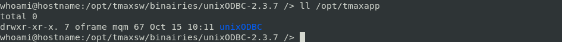

__c.__ Create symbolic link for _libodbc.so.1_ and _libodbc.so_ :
```bash
cd /opt/tmaxapp/unixODBC/lib/
ln -s libodbc.so.2.0.0 libodbc.so.1
ln -s libodbc.so.2.0.0 libodbc.so
```

__d.__ Configure ODBC configuration files (odbc.ini and odbcinst.ini).

- odbc.ini (_/opt/tmaxapp/unixODBC/etc/odbc.ini_) records ODBC driver connection information. Make below changes to odbc.ini:

```text
[ODBC Data Sources]
tibero6 = Tibero6 ODBC driver
[TVSAM]
Driver = /opt/tmaxdb/tibero6/client/lib/libtbodbc.so
Description = Tibero ODBC driver for Tibero6
DSN = TVSAM
SID = TVSAM
User = tibero
Password = tmax
```
For ODBC connection setting, below is the sample that would work for __remote__ Tibero connection. Replace the server address 10.0.2.15 by the remote IP of Tibero server (it is better to use the hostname):

```text
[ODBC Data Sources]
tibero6 = Tibero6 ODBC driver
[TVSAM]
Driver = /opt/tmaxapp/unixODBC/lib/libtbodbc.so
Description = Tibero ODBC driver for Tibero6
SERVER = 10.0.2.15
PORT = 8629
DSN = TVSAM
SID = TVSAM
User = tibero
Password = tmax
DATABASE = TVSAM
```

- odbcinst.ini (_/opt/tmaxapp/unixODBC/odbcinst.ini_). Normally, it should be in the _etc/_ folder but copy it to _unixODBC/_.

```text
[Tibero]
Description = Tibero ODBC driver for Tibero6
Driver = /opt/tmaxdb/tibero6/client/lib/libtbodbc.so
Setup =
FileUsage =
CPTimeout =
CPReuse =
Driver Logging = 7
[ODBC]
Trace = NO
TraceFile = /home/oframe/odbc.log
ForceTrace = Yes
Pooling = No
DEBUG = 1
```

#### 2.3.2 Verification steps

__a.__ Verify if ODBC connection is working fine. Check the unixODBC version and configuration files. Execute `odbcinst -j` to check the unixODBC version as well as the _odbc.ini_ and _odbcinst.ini_ locations in DRIVERS and SYSTEM DATA SOURCES respectively. You probably need to copy _odbc.ini_ and  _odbcinst.ini_ to the folder _/opt/tmaxapp/unixODBC_ to comply with these parameters.

```shell
oframe@ofdemo ~:/opt/tmaxapp/unixODBC/etc /> odbcinst -j
unixODBC 2.3.4
DRIVERS............: /opt/tmaxapp/unixODBC/odbcinst.ini
SYSTEM DATA SOURCES: /opt/tmaxapp/unixODBC/odbc.ini
FILE DATA SOURCES..: /opt/tmaxapp/unixODBC/ODBCDataSources
USER DATA SOURCES..: /opt/tmaxapp/unixODBC/etc/odbc.ini
SQLULEN Size.......: 8
SQLLEN Size........: 8
SQLSETPOSIROW Size.: 8
```

__b.__ Test an isql connection, logged in as oframe user. Type the command as follows (Make sure that Tibero is running before, if not run `tbboot` in another terminal window with oftibr user):
```bash
isql -v TVSAM tibero tmax
```

You should see the following output:
```sql
+---------------------------------------+
| Connected!                            |
|                                       |
| sql-statement                         |
| help [tablename]                      |
| quit                                  |
|                                       |
+---------------------------------------+
SQL>
```
Execute `quit` to leave the menu with SQL commands.

_note: If you have the error “invalid socket file descriptor” message, check if Tibero is up._

## 2.4 Base

#### 2.4.1 Installation
__a.__ Check and edit the following parameters in base.properties (_/opt/tmaxsw/base.properties_) file:
```text     
OPENFRAME_HOME=/opt/tmaxapp/OpenFrame

TP_HOST_NAME=ofdemo
TP_HOST_IP=10.0.2.15 (Replace with your own IP address)
TP_SHMKEY=63481
TP_TPORTNO=6623
TP_UNBLOCK_PORT=6291
TP_NODE_NAME=NODE1
TP_NODE_LIST=NODE1

MASCAT_NAME=SYS1.MASTER.ICFCAT
MASCAT_CREATE=YES
DEFAULT_VOLSER=DEFVOL
SYSTEM_TABLESPACE=OFM_REPOSITORY
VOLADD_DEFINE=YES

ODBC_USERNAME=tibero
ODBC_PASSWORD=tmax
ODBC_DATABASE=TVSAM

TSAM_USERNAME=tibero
TSAM_PASSWORD=tmax
TSAM_DATABASE=TVSAM
TSAM_DBTYPE=TIBERO
DATASET_SHMKEY=63211

DSLOCK_DATA=SYS1.DSLOCK.DATA
DSLOCK_LOG=SYS1.DSLOCK.LOG
DSLOCK_SEQ=dslock_seq.dat
DSLOCK_CREATE=YES

OPENFRAME_LICENSE_PATH=/opt/tmaxsw/licenses/openframe
TMAX_LICENSE_PATH=/opt/tmaxsw/licenses/tmax
```

__b.__ Execute the installer using the properties file and then the bash profile:
```bash
# Make sure you still logged in as oframe, if not run the following line first
su - oframe
# <enter password>
./OpenFrame_Base7_Fix3_Linux_x86_64.bin -f base.properties
. ~/.bash_profile
```

__c.__ Copy and paste the TMAX license into the core folder (it should already be in the folder but just in case double check):
```bash
cp /opt/tmaxsw/licenses/tmax/license.dat /opt/tmaxapp/OpenFrame/core/license
# or simply create a symbolic link
cd /opt/tmaxapp/OpenFrame/core/license
ln -s /opt/tmaxsw/licenses/tmax/license.dat .
```

#### 2.4.2 Verification steps
__a.__ Check the _install_base.log_ and the _OpenFrame_Base7_Fix3_InstallLog.log_ files:
```bash
cd $OPENFRAME_HOME/UninstallerData/log
vi install_base.log
vi OpenFrame_Base7_Fix3_InstallLog.log
```
If you have been provided with logs, check that they are similar to yours.

__b.__ Boot up Base with the command: `tmboot`

Output:
```text
TMBOOT for node(NODE1) is starting:
Welcome to Tmax demo system: it will expire 2019/12/3
Today: 2019/10/15
	TMBOOT: TMM is starting: Tue Oct 15 13:26:36 2019
	TMBOOT: CLL is starting: Tue Oct 15 13:26:36 2019
	TMBOOT: CLH is starting: Tue Oct 15 13:26:36 2019
	TMBOOT: TLM(tlm) is starting: Tue Oct 15 13:26:36 2019
	TMBOOT: SVR(ofrsasvr) is starting: Tue Oct 15 13:26:36 2019
	TMBOOT: SVR(ofrlhsvr) is starting: Tue Oct 15 13:26:36 2019
	TMBOOT: SVR(ofrdmsvr) is starting: Tue Oct 15 13:26:36 2019
	TMBOOT: SVR(ofrdsedt) is starting: Tue Oct 15 13:26:36 2019
	TMBOOT: SVR(ofrcmsvr) is starting: Tue Oct 15 13:26:36 2019
	TMBOOT: SVR(ofruisvr) is starting: Tue Oct 15 13:26:36 2019
	TMBOOT: SVR(ofruisvr) is starting: Tue Oct 15 13:26:36 2019
	TMBOOT: SVR(ofrsmlog) is starting: Tue Oct 15 13:26:36 2019
	TMBOOT: SVR(vtammgr) is starting: Tue Oct 15 13:26:36 2019
```

__c.__ Verify process ready status using `tmadmin`. Then use the command `si`, all the processes should have RDY status.
```text
--- Welcome to Tmax Admin (Type "quit" to leave) ---

$$1 NODE1 (tmadm): si
------------------------------------------------------------------------
  clh   svrname    (svri)   status     count   qcount   qpcount  emcount
------------------------------------------------------------------------
    0   ofrsasvr   (   4)      RDY         0        0         0        0
    0   ofrlhsvr   (   5)      RDY         0        0         0        0
    0   ofrdmsvr   (   6)      RDY         0        0         0        0
    0   ofrdsedt   (   7)      RDY         0        0         0        0
    0   ofrcmsvr   (   8)      RDY         0        0         0        0
    0   ofruisvr   (   9)      RDY         0        0         0        0
    0   ofrsmlog   (  10)      RDY         0        0         0        0
    0   vtammgr    (  11)      RDY         0        0         0        0

$$2 NODE1 (tmadm): quit
ADM quit for node (NODE1)
```

If you don't have all processes in RDY state, stop the installation and review the logs. You can find the logs for each process in the folder _/opt/tmaxapp/OpenFrame/log/tmax/ulog_. Then run the following command to easily find the logs related to the process that has an issue:
```bash
ls | grep process-name
vi process-name.date.err
```

__d.__ Shutdown Base with : `tmdown` or better with `tmdown -y`

Output:
```text
Do you really want to down whole Tmax? (y : n): y

TMDOWN for node(NODE1) is starting:
	TMDOWN: SERVER(ofrdmsvr:38) downed: Mon Oct 14 14:34:02 2019
	TMDOWN: SERVER(ofrdsedt:39) downed: Mon Oct 14 14:34:02 2019
	TMDOWN: SERVER(ofrsasvr:36) downed: Mon Oct 14 14:34:02 2019
	TMDOWN: SERVER(ofruisvr:42) downed: Mon Oct 14 14:34:02 2019
	TMDOWN: SERVER(ofruisvr:41) downed: Mon Oct 14 14:34:02 2019
	TMDOWN: SERVER(ofrcmsvr:40) downed: Mon Oct 14 14:34:02 2019
	TMDOWN: SERVER(vtammgr:47) downed: Mon Oct 14 14:34:02 2019
	TMDOWN: SERVER(ofrlhsvr:37) downed: Mon Oct 14 14:34:02 2019
	TMDOWN: SERVER(ofrsmlog:46) downed: Mon Oct 14 14:34:02 2019
	TMDOWN: CLH downed: Mon Oct 14 14:34:02 2019
	TMDOWN: CLL downed: Mon Oct 14 14:34:02 2019
	TMDOWN: TLM downed: Mon Oct 14 14:34:02 2019
	TMDOWN: TMM downed: Mon Oct 14 14:34:02 2019
	TMDOWN: TMAX is down
```

## 2.5 Install Batch

#### 2.5.1 Installation
__a.__ Check and edit the following parameters in batch.properties (_/opt/tmaxsw/batch.properties_) file:
```text     
OPENFRAME_HOME=/opt/tmaxapp/OpenFrame

DEFAULT_VOLSER=DEFVOL
BATCH_TABLE_CREATE=YES
SYSTEM_TABLESPACE=OFM_REPOSITORY

TP_NODE_NAME=NODE1
TP_NODE_LIST=NODE1

RESOURCE_SHMKEY=66991
DEFAULT_JCLLIB_CREATE=YES
DEFAULT_PROCLIB_CREATE=YES
DEFAULT_USERLIB_CREATE=YES
DEFAULT_TEMPLIB_CREATE=YES

TJES_USERNAME=tibero
TJES_PASSWORD=tmax
TJES_DATABASE=TVSAM
```

__b.__ Take a backup of core configuration file:
```bash
# Make sure you still logged in as oframe, if not run the following line first
su - oframe
# <enter password>
cd /opt/tmaxapp/OpenFrame/core/config
cp oframe.m oframe_base.m
```

__c.__ Execute the installer using the properties file:
```bash
cd /opt/tmaxsw
./OpenFrame_Batch7_Fix3_MVS_Linux_x86_64.bin -f batch.properties
```

__d.__ Verify if the license _lictjes.dat_ is in the folder _/opt/tmaxapp/OpenFrame/license_ .If not, copy or link the license:
```bash
cd /opt/tmaxapp/OpenFrame/license
ls
# If necessary
ln –s /opt/tmaxsw/licenses/openframe/lictjes.dat .
```

__d.__ Execute the bash profile: `. ~/.bash_profile`

#### 2.5.2 Verification steps
__a.__ Check the _install_batch.log_ and the _OpenFrame_Batch7_Fix3_MVS_InstallLog.log_ files:
```bash
cd $OPENFRAME_HOME/UninstallerData/log
vi install_batch.log
vi OpenFrame_Batch7_Fix3_MVS_InstallLog.log
```
If you have been provided with logs, check that they are similar to yours.

__b.__ Boot up Batch: `tmboot`

Output:
```text
TMBOOT for node(NODE1) is starting:
Welcome to Tmax demo system: it will expire 2019/12/3
Today: 2019/10/15
	TMBOOT: TMM is starting: Tue Oct 15 13:40:35 2019
	TMBOOT: CLL is starting: Tue Oct 15 13:40:35 2019
	TMBOOT: CLH is starting: Tue Oct 15 13:40:35 2019
	TMBOOT: TLM(tlm) is starting: Tue Oct 15 13:40:35 2019
	TMBOOT: SVR(ofrsasvr) is starting: Tue Oct 15 13:40:35 2019
	TMBOOT: SVR(ofrlhsvr) is starting: Tue Oct 15 13:40:35 2019
	TMBOOT: SVR(ofrdmsvr) is starting: Tue Oct 15 13:40:35 2019
	TMBOOT: SVR(ofrdsedt) is starting: Tue Oct 15 13:40:35 2019
	TMBOOT: SVR(ofrcmsvr) is starting: Tue Oct 15 13:40:35 2019
	TMBOOT: SVR(ofruisvr) is starting: Tue Oct 15 13:40:35 2019
	TMBOOT: SVR(ofruisvr) is starting: Tue Oct 15 13:40:35 2019
	TMBOOT: SVR(ofrsmlog) is starting: Tue Oct 15 13:40:35 2019
	TMBOOT: SVR(vtammgr) is starting: Tue Oct 15 13:40:35 2019
	TMBOOT: SVR(obmjmsvr) is starting: Tue Oct 15 13:40:35 2019  <--------
	TMBOOT: SVR(obmjschd) is starting: Tue Oct 15 13:40:35 2019  <--------
	TMBOOT: SVR(obmjinit) is starting: Tue Oct 15 13:40:35 2019  <--------
	TMBOOT: SVR(obmjhist) is starting: Tue Oct 15 13:40:35 2019  <--------
	TMBOOT: SVR(obmjspbk) is starting: Tue Oct 15 13:40:35 2019  <--------
	TMBOOT: SVR(ofrpmsvr) is starting: Tue Oct 15 13:40:35 2019  <--------
	TMBOOT: SVR(obmtsmgr) is starting: Tue Oct 15 13:40:35 2019  <--------
	TMBOOT: SVR(obmjtimr) is starting: Tue Oct 15 13:40:35 2019  <--------
```

__c.__ Verify process ready status using `tmadmin`. Then use the command `si`, all the processes should have RDY status:
```text
--- Welcome to Tmax Admin (Type "quit" to leave) ---

   $$1 NODE1 (tmadm): si

   ------------------------------------------------------------------------
   clh   svrname    (svri)   status     count   qcount   qpcount  emcount
   ------------------------------------------------------------------------
    0   ofrsasvr   (   4)      RDY         0        0         0        0
    0   ofrlhsvr   (   5)      RDY         0        0         0        0
    0   ofrdmsvr   (   6)      RDY         0        0         0        0
    0   ofrdsedt   (   7)      RDY         0        0         0        0
    0   ofrcmsvr   (   8)      RDY         0        0         0        0
    0   ofruisvr   (   9)      RDY         0        0         0        0
    0   ofrsmlog   (  10)      RDY         0        0         0        0
    0   vtammgr    (  11)      RDY         0        0         0        0
    0   obmjmsvr   (  12)      RDY         0        0         0        0
    0   obmjschd   (  13)      RDY         1        0         0        0
    0   obmjinit   (  14)      RDY         2        0         0        0
    0   obmjhist   (  15)      RDY         0        0         0        0
    0   obmjspbk   (  16)      RDY         0        0         0        0
    0   ofrpmsvr   (  17)      RDY         0        0         0        0
    0   obmtsmgr   (  18)      RDY         0        0         0        0
    0   obmjtimr   (  19)      RDY         0        0         0        0


   $$2 NODE1 (tmadm): quit
   ADM quit for node (NODE1)
```

__e.__ Shutdown Batch: `tmdown` or better `tmdown -y`

Output:
```text
Do you really want to down whole Tmax? (y : n): y

TMDOWN for node(NODE1) is starting:
	TMDOWN: SERVER(ofrcmsvr:40) downed: Tue Oct 15 13:46:18 2019
	TMDOWN: SERVER(ofrlhsvr:37) downed: Tue Oct 15 13:46:18 2019
	TMDOWN: SERVER(obmjmsvr:48) downed: Tue Oct 15 13:46:18 2019
	TMDOWN: SERVER(obmjhist:51) downed: Tue Oct 15 13:46:18 2019
	TMDOWN: SERVER(ofrdsedt:39) downed: Tue Oct 15 13:46:18 2019
	TMDOWN: SERVER(obmjspbk:52) downed: Tue Oct 15 13:46:18 2019
	TMDOWN: SERVER(ofrsasvr:36) downed: Tue Oct 15 13:46:18 2019
	TMDOWN: SERVER(ofrdmsvr:38) downed: Tue Oct 15 13:46:18 2019
	TMDOWN: SERVER(ofruisvr:41) downed: Tue Oct 15 13:46:18 2019
	TMDOWN: SERVER(ofruisvr:42) downed: Tue Oct 15 13:46:18 2019
	TMDOWN: SERVER(obmjschd:49) downed: Tue Oct 15 13:46:18 2019
	TMDOWN: SERVER(ofrpmsvr:53) downed: Tue Oct 15 13:46:18 2019
	TMDOWN: SERVER(obmjinit:50) downed: Tue Oct 15 13:46:18 2019
	TMDOWN: SERVER(vtammgr:47) downed: Tue Oct 15 13:46:18 2019
	TMDOWN: SERVER(obmjtimr:55) downed: Tue Oct 15 13:46:18 2019
	TMDOWN: SERVER(obmtsmgr:54) downed: Tue Oct 15 13:46:18 2019
	TMDOWN: SERVER(ofrsmlog:46) downed: Tue Oct 15 13:46:18 2019
	TMDOWN: CLL downed: Tue Oct 15 13:46:18 2019
	TMDOWN: CLH downed: Tue Oct 15 13:46:18 2019
	TMDOWN: TLM downed: Tue Oct 15 13:46:18 2019
	TMDOWN: TMM downed: Tue Oct 15 13:46:18 2019
	TMDOWN: TMAX is down
```

#### 2.5.3 Script editing
Edit the OpenFrame configuration file _tjclrun.conf_:
```bash
vi /opt/tmaxapp/OpenFrame/config/tjclrun.conf
```    
Then, add the _OBCD_HOME_ lib (highlighted in red):
[SYSLIB]
BIN_PATH=${OPENFRAME_HOME}/bin:${OPENFRAME_HOME}/util:${COBDIR}/bin:/usr/local/bin:/bin
LIB_PATH=${OPENFRAME_HOME}/lib:${OPENFRAME_HOME}/core/lib:${TB_HOME}/client/lib:${COBDIR}/lib:/usr/lib:/lib:/lib/i686:/usr/local/lib:${PROSORT_HOME}/lib:/opt/FSUNbsort/lib<span style="color:red">:${ODBC_HOME}/lib</span>

## 2.6 Install TACF

#### 2.6.1 Installation
__a.__ Check and edit the following parameters in tacf.properties (_/opt/tmaxsw/tacf.properties_) file:
```text     
OPENFRAME_HOME=/opt/tmaxapp/OpenFrame
USE_OS_AUTH=NO
TACF_USERNAME=tibero
TACF_PASSWORD=tmax
TACF_DATABASE=TVSAM
TACF_TABLESPACE=TACF00
TACF_TABLE_CREATE=YES
```

__b.__ Take a backup of core configuration file:
```bash
# Make sure you still logged in as oframe, if not run the following line first
su - oframe
# <enter password>
cd /opt/tmaxapp/OpenFrame/core/config
cp oframe.m oframe_base_batch.m
```

__c.__ Execute the installer using the properties file and then the bash profile:
```bash
./OpenFrame_Tacf7_Fix3_Linux_x86_64.bin -f tacf.properties
. ~/.bash_profile
```

__d.__ Move the file _.tacfpass_ to _/home/oframe_:
```bash
cd /opt/tmaxsw/scripts/tacf
mv .tacfpass /home/oframe
```

#### 2.6.2 Verification steps
__a.__ Check the _install_tacf.log_ and the _OpenFrame_Tacf7_Fix3_InstallLog.log_ files::
```bash
cd /opt/tmaxapp/OpenFrame/UninstallerData/log
vi install_tacf.log
vi OpenFrame_Tacf7_Fix3_InstallLog.log
```
If you have been provided with logs, check that they are similar to yours.

__b.__ Boot up TACF: `tmboot`

Output:
```text
TMBOOT for node(NODE1) is starting:
Welcome to Tmax demo system: it will expire 2019/12/3
Today: 2019/10/17
	TMBOOT: TMM is starting: Thu Oct 17 10:05:01 2019
	TMBOOT: CLL is starting: Thu Oct 17 10:05:01 2019
	TMBOOT: CLH is starting: Thu Oct 17 10:05:01 2019
	TMBOOT: TLM(tlm) is starting: Thu Oct 17 10:05:01 2019
	TMBOOT: SVR(ofrsasvr) is starting: Thu Oct 17 10:05:01 2019
	TMBOOT: SVR(ofrlhsvr) is starting: Thu Oct 17 10:05:01 2019
	TMBOOT: SVR(ofrdmsvr) is starting: Thu Oct 17 10:05:01 2019
	TMBOOT: SVR(ofrdsedt) is starting: Thu Oct 17 10:05:01 2019
	TMBOOT: SVR(ofrcmsvr) is starting: Thu Oct 17 10:05:01 2019
	TMBOOT: SVR(ofruisvr) is starting: Thu Oct 17 10:05:01 2019
	TMBOOT: SVR(ofruisvr) is starting: Thu Oct 17 10:05:01 2019
	TMBOOT: SVR(ofrsmlog) is starting: Thu Oct 17 10:05:01 2019
	TMBOOT: SVR(vtammgr) is starting: Thu Oct 17 10:05:01 2019
	TMBOOT: SVR(obmjmsvr) is starting: Thu Oct 17 10:05:01 2019
	TMBOOT: SVR(obmjschd) is starting: Thu Oct 17 10:05:01 2019
	TMBOOT: SVR(obmjinit) is starting: Thu Oct 17 10:05:01 2019
	TMBOOT: SVR(obmjhist) is starting: Thu Oct 17 10:05:01 2019
	TMBOOT: SVR(obmjspbk) is starting: Thu Oct 17 10:05:01 2019
	TMBOOT: SVR(ofrpmsvr) is starting: Thu Oct 17 10:05:01 2019
	TMBOOT: SVR(obmtsmgr) is starting: Thu Oct 17 10:05:01 2019
	TMBOOT: SVR(obmjtimr) is starting: Thu Oct 17 10:05:01 2019
	TMBOOT: SVR(tmsvr) is starting: Thu Oct 17 10:05:01 2019      <--------
```

__c.__ Verify process ready status using `tmadmin`. Then use the command `si`, all the processes should have RDY status:
```text
--- Welcome to Tmax Admin (Type "quit" to leave) ---

$$1 NODE1 (tmadm): si
------------------------------------------------------------------------
clh   svrname    (svri)   status     count   qcount   qpcount  emcount
------------------------------------------------------------------------
0   ofrsasvr   (   4)      RDY         0        0         0        0
0   ofrlhsvr   (   5)      RDY         0        0         0        0
0   ofrdmsvr   (   6)      RDY         0        0         0        0
0   ofrdsedt   (   7)      RDY         0        0         0        0
0   ofrcmsvr   (   8)      RDY         0        0         0        0
0   ofruisvr   (   9)      RDY         0        0         0        0
0   ofrsmlog   (  10)      RDY         0        0         0        0
0   vtammgr    (  11)      RDY         0        0         0        0
0   obmjmsvr   (  12)      RDY         0        0         0        0
0   obmjschd   (  13)      RDY         1        0         0        0
0   obmjinit   (  14)      RDY         2        0         0        0
0   obmjhist   (  15)      RDY         0        0         0        0
0   obmjspbk   (  16)      RDY         0        0         0        0
0   ofrpmsvr   (  17)      RDY         0        0         0        0
0   obmtsmgr   (  18)      RDY         0        0         0        0
0   tmsvr      (  19)      RDY         0        0         0        0

$$2 NODE1 (tmadm): quit
ADM quit for node (NODE1)
```

__d.__ Shutdown TACF: `tmdown` or better `tmdown -y`

Output:
```text
Do you really want to down whole Tmax? (y : n): y

TMDOWN for node(NODE1) is starting:
	TMDOWN: SERVER(ofrdsedt:39) downed: Thu Oct 17 10:09:35 2019
	TMDOWN: SERVER(ofrcmsvr:40) downed: Thu Oct 17 10:09:35 2019
	TMDOWN: SERVER(ofrdmsvr:38) downed: Thu Oct 17 10:09:35 2019
	TMDOWN: SERVER(obmjhist:51) downed: Thu Oct 17 10:09:35 2019
	TMDOWN: SERVER(vtammgr:47) downed: Thu Oct 17 10:09:35 2019
	TMDOWN: SERVER(tmsvr:56) downed: Thu Oct 17 10:09:35 2019
	TMDOWN: SERVER(ofrsasvr:36) downed: Thu Oct 17 10:09:35 2019
	TMDOWN: SERVER(obmjtimr:55) downed: Thu Oct 17 10:09:35 2019
	TMDOWN: SERVER(ofrlhsvr:37) downed: Thu Oct 17 10:09:35 2019
	TMDOWN: SERVER(ofruisvr:42) downed: Thu Oct 17 10:09:35 2019
	TMDOWN: SERVER(ofruisvr:41) downed: Thu Oct 17 10:09:35 2019
	TMDOWN: SERVER(obmjinit:50) downed: Thu Oct 17 10:09:35 2019
	TMDOWN: SERVER(obmjmsvr:48) downed: Thu Oct 17 10:09:35 2019
	TMDOWN: SERVER(obmtsmgr:54) downed: Thu Oct 17 10:09:35 2019
	TMDOWN: SERVER(ofrsmlog:46) downed: Thu Oct 17 10:09:36 2019
	TMDOWN: CLH downed: Thu Oct 17 10:09:36 2019
	TMDOWN: CLL downed: Thu Oct 17 10:09:36 2019
	TMDOWN: TLM downed: Thu Oct 17 10:09:36 2019
	TMDOWN: TMM downed: Thu Oct 17 10:09:36 2019
	TMDOWN: TMAX is down
```

__e.__ Take a backup of core configuration file:
```bash
cd /opt/tmaxapp/OpenFrame/core/config
cp oframe.m oframe_base_batch_tacf.m
```

## 2.7 Install ProSort

#### 2.7.1 Installation
__a.__ 	Untar the prosort archive:
```bash
# Make sure you still logged in as oframe, if not run the following line first
su - oframe
# <enter password>
cd /opt/tmaxsw
tar -zxvf prosort-bin-prosort_2sp3-linux64-2167-opt.tar.gz
```

__b.__ Verify if a folder is created in _/opt/tmaxsw_: `ls`. There should be a _prosort_ folder. Move this folder to _/opt/tmaxapp_:
```bash
mv prosort /opt/tmaxapp
```
The _tmaxapp/_ folder should looks like:


__c.__	Set up license file:
```bash
mkdir /opt/tmaxapp/prosort/license
cd /opt/tmaxapp/prosort/license
cp /opt/tmaxsw/licenses/prosort/license.xml .
```

__d.__ Create the configuration file:
```bash   
cd /opt/tmaxapp/prosort/config
./gen_tip.sh
```
Expected output:
```text
Using PROSORT_SID "gbg"
/opt/tmaxapp/prosort/config/gbg.tip generated
```

__e.__ Create the symbolic link for SORT:
```bash
cd /opt/tmaxapp/OpenFrame/util/
ln -s DFSORT SORT
```

#### 2.7.2 Verification steps
__a.__ Verify PROSORT installation: `prosort -h`

Expected output:
```text
Usage: prosort [options] [sort script files]

options
-------
 -h             Display this information
 -v             Display version information
 -s             Display state information
 -j             Display profile information
 -x             Use SyncSort compatible mode
```

## 2.8 Install ProTrieve

#### 2.8.1 Installation
__a.__ Execute the installer
```bash
# Make sure you still logged in as oframe, if not run the following line first
su - oframe
# <enter password>
cd /opt/tmaxsw
./ ProTrieve2_1_Linux_x86_64.bin
```

__b.__ Change the path to _/opt/tmaxapp/protrieve_ as below (if the folder does not exist, the installation program will automatically create it):
```text
Choose Install Folder
---------------------

Where would you like to install?

	Default Install Folder: /home/oframe/protrieve

ENTER AN ABSOLUTE PATH, OR PRESS <ENTER> TO ACCEPT THE DEFAULT
  : /opt/tmaxapp/protrieve
```

__c.__ Verify if the bash profile is updated with Protrieve variables and execute it:
```bash
cd ~
vi .bash_profile
. .bash_profile
```

__d.__ Setup the license file:
```bash
cd /opt/tmaxapp/protrieve/license
ln -s /opt/tmaxsw/licenses/licprot.dat licprot.dat
```

__e.__ Create a backup of the OpenFrame configuration file _/opt/tmaxapp/OpenFrame/config/tjclrun.conf_:
```bash
cd /opt/tmaxapp/OpenFrame/config/
cp tjclrun.conf tjclrun.conf.bck1
```
Then, add the _PROTRIEVE_HOME_ lib (highlighted in red):
[SYSLIB]
BIN_PATH=${OPENFRAME_HOME}/bin:${OPENFRAME_HOME}/util:${COBDIR}/bin:/usr/local/bin:/bin:${OPENFRAME_HOME}/volume_default/SYS1.LOADLIB<span style="color:red">/bin:${PROTRIEVE_HOME}/bin</span>
LIB_PATH=${OPENFRAME_HOME}/lib:${OPENFRAME_HOME}/core/lib:${TB_HOME}/client/lib:${COBDIR}/lib:/usr/lib:/lib:/lib/i686:/usr/local/lib:${PROSORT_HOME}/lib:/opt/FSUNbsort/lib:${ODBC_HOME}/lib<span style="color:red">:${PROTRIEVE_HOME}/lib</span>

#### 2.8.2 Verification steps
__a.__ Review _ProTrieve_InstallLog.log_ and verify that there are no errors:
```bash
cat $PROTRIEVE_HOME/UninstallerData/log/ProTrieve_InstallLog.log
```
If you have been provided with logs, check that they are similar to yours.

__b.__ Review the version number: `protp –v`

Expected output:
```text
ProTrieve 2.1
Copyright (C) 2018 TMAXSOFT RESERVED
```

__c.__ Perform OpenFrame reboot: `tmboot` then `tmdown`

## 2.9 Install OFCOBOL

#### 2.9.1 Installation
__a.__ First execute the installer:
```bash
# Make sure you still logged in as oframe, if not run the following line first
su - oframe
# <enter password>
cd /opt/tmaxsw
./OpenFrame_COBOL4_472_Linux_x86_64.bin
```

Change the path to _/opt/tmaxapp/OFCOBOL_ as below (folder automatically created during the installation process):
```text
Choose Install Folder
---------------------

Where would you like to install?

		Default Install Folder: /home/oframe/OFCOBOL

ENTER AN ABSOLUTE PATH, OR PRESS <ENTER> TO ACCEPT THE DEFAULT
    : /opt/tmaxapp/OFCOBOL
```

__c.__ Verify if the bash profile is updated with OFCOBOL variables and execute it:
```bash
vi ~/.bash_profile
. ~/.bash_profile
```

__d.__ Setup the license file:
```bash
cd /opt/tmaxapp/OFCOBOL/license
ln -s /opt/tmaxsw/licenses/openframe/licofcob.dat licofcob.dat
```

__e.__ Create a backup of the OpenFrame configuration file _/opt/tmaxapp/OpenFrame/config/tjclrun.conf_:
```bash
cd /opt/tmaxapp/OpenFrame/config/
cp tjclrun.conf tjclrun.conf.bck2
```
Then, add the _OFCOB_HOME_ lib (highlighted in red):
[SYSLIB]
LIB_PATH=${OPENFRAME_HOME}/lib:${OPENFRAME_HOME}/core/lib:${TB_HOME}/client/lib:${COBDIR}/lib:/usr/lib:/lib:/lib/i686:/usr/local/lib:${PROSORT_HOME}/lib:/opt/FSUNbsort/lib:${ODBC_HOME}/lib:${PROTRIEVE_HOME}/lib<span style="color:red">:${OFCOB_HOME}/lib</span>

#### 2.9.2 Verification steps
__a.__ Review _OpenFrame_COBOL_InstallLog.log_ and verify there are no errors:
```bash
vi $OFCOB_HOME/UninstallerData/log/OpenFrame_COBOL_InstallLog.log
```
If you have been provided with logs, check that they are similar to yours.

__b.__ Review the version number: `ofcob –-version`

Expected output:
```text
OpenFrame COBOL Compiler 4
Revision : 472
CommitID : c20ee10
```

__c.__ Try to create a small COBOL program after installation completed:
```bash
vi HELLO.cob
```
Add the following lines to the file:
```cobol
000100 IDENTIFICATION DIVISION.
000200 PROGRAM-ID.     HELLO.
000300 ENVIRONMENT DIVISION.
000400 DATA DIVISION.
000500 WORKING-STORAGE SECTION.
000600 PROCEDURE DIVISION.
000600     DISPLAY "Hello world!"
```
Then you can compile it:
```bash
ofcob -o HELLO.so HELLO.cob
```

__d.__ Perform OpenFrame reboot: `tmboot` then `tmdown -y`

## 2.10 Install OFPLI

#### 2.10.1 Installation
__a.__ Execute the installer:
```bash
# Make sure you still logged in as oframe, if not run the following line first
su - oframe
# <enter password>
cd /opt/tmaxsw
./OpenFrame_PLI3_427_Linux_x86_64.bin
```

Change the path to _/opt/tmaxapp/OFPLI_ as below (folder automatically created during the installation process):
```text
Choose Install Folder
---------------------

Where would you like to install?

	Default Install Folder: /home/oframe/OFPLI

ENTER AN ABSOLUTE PATH, OR PRESS <ENTER> TO ACCEPT THE DEFAULT
  : /opt/tmaxapp/OFPLI
```

__b.__ Verify if the bash profile is updated with OFPLI variables and execute it:
```bash
vi ~/.bash_profile
. ~/.bash_profile
```

__c.__ Setup the license file:
```bash
cp /opt/tmaxsw/licenses/openframe/licofpli.dat /opt/tmaxapp/OFPLI/license/
```

__d.__ Create a backup of the OpenFrame configuration file _/opt/tmaxapp/OpenFrame/config/tjclrun.conf_:
```bash
cd /opt/tmaxapp/OpenFrame/config/
cp tjclrun.conf tjclrun.conf.bck3
```
Then, add the _OFPLI_HOME_ lib (highlighted in red):
[SYSLIB]
LIB_PATH=${OPENFRAME_HOME}/lib:${OPENFRAME_HOME}/core/lib:${TB_HOME}/client/lib:${COBDIR}/lib:/usr/lib:/lib:/lib/i686:/usr/local/lib:${PROSORT_HOME}/lib:/opt/FSUNbsort/lib:${ODBC_HOME}/lib:${PROTRIEVE_HOME}/lib:${OFCOB_HOME}/lib<span style="color:red">:${OFPLI_HOME}/lib</span>

#### 2.10.2 Verification steps
__a.__ Review _OpenFrame_PLI_InstallLog.log_ and verify there are no errors:
```bash
vi $OFPLI_HOME/UninstallerData/log/OpenFrame_PLI_InstallLog.log
```
If you have been provided with logs, check that they are similar to yours.

__b.__ Review the version number: `ofpli –-version`

Expected output:
```text
OpenFrame PL/I Compiler 3
Revision: 427
CommitID: 6ca0580
```

__c.__ Review the license: `ofpli -–license`

Expected output:
```text

	###############################################
	  License Information
	###############################################

product name: OFPLI
License issue date: 2019/10/3
License type: DEMO
Expiration date: 2020/1/3
Edition: Base
License check by hostname: ofdemo
Unlimited license
```

__d.__ Perform OpenFrame reboot: `tmboot` then `tmdown -y`

## 2.11 Install OFASM

#### 2.11.1 Installation
__a.__ Execute the installer:
```bash
# Make sure you still logged in as oframe, if not run the following line first
su - oframe
# <enter password>
cd /opt/tmaxsw
./OpenFrame_ASM4_525_Linux_x86_64.bin
```

__b.__ Change the path to _/opt/tmaxapp/OFASM_ as below:
```text
Choose Install Folder
---------------------

Where would you like to install?

	Default Install Folder: /home/oframe/OFASM

ENTER AN ABSOLUTE PATH, OR PRESS <ENTER> TO ACCEPT THE DEFAULT
  : /opt/tmaxapp/OFASM
```

__c.__ Verify if the bash profile is updated with OFASM variables and execute it:
```bash
vi ~/.bash_profile
. ~/.bash_profile
```

__d.__ Create a backup of the OpenFrame configuration file _/opt/tmaxapp/OpenFrame/config/tjclrun.conf_:
```bash
cd /opt/tmaxapp/OpenFrame/config/
cp tjclrun.conf tjclrun.conf.bck4
```
Then, add the _OFASM_HOME_ lib (highlighted in red):
[SYSLIB]
LIB_PATH=${OPENFRAME_HOME}/lib:${OPENFRAME_HOME}/core/lib:${TB_HOME}/client/lib:${COBDIR}/lib:/usr/lib:/lib:/lib/i686:/usr/local/lib:${PROSORT_HOME}/lib:/opt/FSUNbsort/lib:${ODBC_HOME}/lib:${PROTRIEVE_HOME}/lib:${OFCOB_HOME}/lib:${OFPLI_HOME}/lib<span style="color:red">:${OFASM_HOME}/lib</span>

#### 2.11.2 Verification steps
__a.__ Review _OpenFrame_ASM_InstallLog.log_ and verify there are no errors:
```bash
vi $OFASM_HOME/UninstallerData/log/OpenFrame_ASM_InstallLog.log
```
If you have been provided with logs, check that they are similar to yours.

__b.__ Review the version number: `ofasm –version`

Expected output:
```text
OpenFrame Assembler 4
Revision: 525
CommitID: 87ee037
```

__c.__ Perform OpenFrame reboot: `tmboot` then `tmdown -y`

## 2.12 Install OSC

#### 2.12.1 Installation
__a.__ Check and edit the following parameters in osc.properties (_/opt/tmaxsw/osc.properties_) file:
```text
OPENFRAME_HOME=/opt/tmaxapp/OpenFrame
COBOL=OFCOBOL
PLI=OFPLI
TP_NODE_NAME=NODE1
TCACHE_SHMKEY=63111

TSAM_USERNAME=tibero
TSAM_PASSWORD=tmax
TSAM_DATABASE=TVSAM
DEFAULT_VOLSER=DEFVOL
CORE_TDL_SHMKEY=64111

VTAM_PORT=5577

OSC_APP_SYS_SHMKEY=65111
OSC_APP_USR_SHMKEY=66111
OSC_APP_TSQ_SHMKEY=67111
OSC_APP_CPM_3270_CCSID=37
OSC_APP_CPM_REGION_CCSID=437

OSC_TL_OSCTLSVR_PORT=8654
```

__b.__ Verify that you have the license file in the folder _/opt/tmaxapp/OpenFrame/license_:
```bash
# Make sure you still logged in as oframe, if not run the following line first
su - oframe
# <enter password>
ls /opt/tmaxapp/OpenFrame/license
# You are looking for licosc.dat
```

__c.__ Create a symbolic link for _lodbc.so_  in the folder _/opt/tmaxapp/OpenFrame/lib_:
```bash
cd /opt/tmaxapp/OpenFrame/lib
ln -s /opt/tmaxapp/unixODBC/lib/libodbc.so.2.0.0 libodbc.so
```

__d.__ Execute the installer using the properties file:
```bash
cd /opt/tmaxsw
./OpenFrame_OSC7_Fix3_Linux_x86_64.bin -f osc.properties
```

__e.__ Verify if the bash profile is updated with OSC variables and execute it:
```bash
vi ~/.bash_profile
. ~/.bash_profile
```

__f.__ Edit the configuration file: `vi /opt/tmaxapp/OpenFrame/config/ofsys.seq`

Uncomment the following lines:
```text
#BASE
ofrsasvr
ofrlhsvr
ofrdmsvr
ofrdsedt
ofrcmsvr
ofruisvr
ofrsmlog
vtammgr
TPFMAGENT

#BATCH
obmtsmgr
ofrpmsvr
obmjmsvr
obmjschd
obmjinit
obmjhist
obmjspbk
# Add the following one
obmjtimr

#TACF
tmsvr
```

#### 2.12.2 Verification steps
__a.__ Review _install_OSC.log_ and _OpenFrame_OSC7_0_Fix3_InstallLog.log_ files:
```bash
cat /opt/tmaxapp/OpenFrame/UninstallerData/log/install_OSC.log
cat /opt/tmaxapp/OpenFrame/UninstallerData/log/OpenFrame_OSC7_Fix3_InstallLog.log
```
If you have been provided with logs, check that they are similar to yours.

__b.__ OSC Start up and Shutdown: `oscboot`

Output:
```text
OSCBOOT : pre-processing                                              [ OK ]

TMBOOT for node(NODE1) is starting:
Welcome to Tmax demo system: it will expire 2019/12/3
Today: 2019/11/13
	TMBOOT: TMM is starting: Wed Nov 13 13:26:52 2019
	TMBOOT: CLL is starting: Wed Nov 13 13:26:52 2019
	TMBOOT: CLH is starting: Wed Nov 13 13:26:52 2019
	TMBOOT: TLM(tlm) is starting: Wed Nov 13 13:26:52 2019
OSCBOOT : system server(ofrsasvr)                                     [ OK ]
OSCBOOT : system server(ofrlhsvr)                                     [ OK ]
OSCBOOT : system server(ofrdmsvr)                                     [ OK ]
OSCBOOT : system server(ofrdsedt)                                     [ OK ]
OSCBOOT : system server(ofrcmsvr)                                     [ OK ]
OSCBOOT : system server(ofruisvr)                                     [ OK ]
OSCBOOT : system server(ofrsmlog)                                     [ OK ]
OSCBOOT : system server(vtammgr)                                      [ OK ]
OSCBOOT : system server(TPFMAGENT)                                    [ OK ]
OSCBOOT : system server(obmtsmgr)                                     [ OK ]
OSCBOOT : system server(ofrpmsvr)                                     [ OK ]
OSCBOOT : system server(obmjmsvr)                                     [ OK ]
OSCBOOT : system server(obmjschd)                                     [ OK ]
OSCBOOT : system server(obmjinit)                                     [ OK ]
OSCBOOT : system server(obmjhist)                                     [ OK ]
OSCBOOT : system server(obmjspbk)                                     [ OK ]
OSCBOOT : system server(obmjtimr)                                     [ OK ]
OSCBOOT : system server(tmsvr)                                        [ OK ]
OSCBOOT : OSC server(oscmgr)                                          [ OK ]
OSCBOOT : OSC server(oscmcsvr)                                        [ OK ]
OSCBOOT : OSC server(oscmnsvr)                                        [ OK ]
OSCBOOT : OSC server(oscdfsvr)                                        [ OK ]
OSCBOOT : OSC server(oscncsvr)                                        [ OK ]
OSCBOOT : OSC server(oscolsvr)                                        [ OK ]
OSCBOOT : OSC server(oscscsvr)                                        [ OK ]
OSCBOOT : OSC server(oscjcsvr)                                        [ OK ]
OSCBOOT : OSC RTSD loading(OSCOIVP1)                                  [ OK ]
OSCBOOT : OSC region server(OSCOIVP1TL)                               [ OK ]
OSCBOOT : OSC region server(OSCOIVP1OMC)                              [ OK ]
OSCBOOT : OSC region server(OSCOIVP1C)                                [ OK ]
OSCBOOT : OSC region server(OSCOIVP1)                                 [ OK ]
OSCBOOT : OSC trancalss server(OSCOIVP1_TCL1)                         [ OK ]
OSCBOOT : OSC PLTPI loading(OSCOIVP1)                                 [ OK ]
OSCBOOT : OSC Region(OSCOIVP1)                                        [ OK ]
OSCBOOT : post-processing                                             [ OK ]
```

- Verify process ready status using `tmadmin`. Then use the command `si`, all the processes should have RDY status:

--- Welcome to Tmax Admin (Type "quit" to leave) ---

$$1 NODE1 (tmadm): si
------------------------------------------------------------------------
  clh   svrname    (svri)   status     count   qcount   qpcount  emcount
------------------------------------------------------------------------
    0   ofrsasvr   (   4)      RDY         0        0         0        0
    0   ofrlhsvr   (   5)      RDY        11        0         0        0
    0   ofrdmsvr   (   6)      RDY         0        0         0        0
    0   ofrdsedt   (   7)      RDY         0        0         0        0
    0   ofrcmsvr   (   8)      RDY         0        0         0        0
    0   ofruisvr   (   9)      RDY         0        0         0        0
    0   ofrsmlog   (  10)      RDY         0        0         0        0
    0   vtammgr    (  11)      RDY         0        0         0        0
    0   obmjmsvr   (  12)      RDY         0        0         0        0
    0   obmjschd   (  13)      RDY         1        0         0        0
    0   obmjinit   (  14)      RDY         2        0         0        0
    0   obmjhist   (  15)      RDY         0        0         0        0
    0   obmjspbk   (  16)      RDY         0        0         0        0
    0   ofrpmsvr   (  17)      RDY         0        0         0        0
    0   obmtsmgr   (  18)      RDY         0        0         0        0
    0   obmjtimr   (  19)      RDY         0        0         0        0
    0   tmsvr      (  20)      RDY         0        0         0        0
    0   oscmgr     (  21)      RDY         2        0         0        0
    0   oscmcsvr   (  22)      RDY         0        0         0        0
    0   oscmnsvr   (  23)      RDY         0        0         0        0
    0   oscncsvr   (  24)      RDY         0        0         0        0
    0   oscolsvr   (  25)      RDY         0        0         0        0
    0   oscscsvr   (  26)      RDY         2        0         0        0
    0   oscdfsvr   (  27)      RDY         0        0         0        0
    0   oscjcsvr   (  28)      RDY         0        0         0        0
    0   OSCOIVP1   (  29)      RDY         1        0         0        0
    0   OSCOIVP1C  (  30)      RDY         0        0         0        0
    0   OSCOIVP1OMC (  31)      RDY         0        0         0        0
    0   OSCOIVP1TL (  32)      RDY         2        0         0        0
    0   OSCOIVP1_TCL1 (  33)      RDY         0        0         0        0
    0   TPFMAGENT  (  34)      RDY         1        0         0        0

$$2 NODE1 (tmadm): quit
ADM quit for node (NODE1)

## 2.13 JEUS

#### 2.13.1 Ant-Apache
Ant is an automation build tool such as make, or Maven. This tool is required to build JEUS.

__a.__ Install ant-apache:
```bash
cd /opt/tmaxsw
tar -xzvf apache-ant-1.9.7-bin.tar.gz
mv apache-ant-1.9.7 /opt/tmaxui/
```

__b.__	Create a symbolic link for efficiency:
```bash
cd /opt/tmaxui
ln -s apache-ant-1.9.7 ant
```

#### 2.13.2 Installation
__a.__ Untar the JEUS folder and move it to _/opt/tmaxui/_:
```bash
cd /opt/tmaxsw
tar -xzvf jeus704.tar.gz
mv jeus7 /opt/tmaxui/.
```

__b.__ Take a backup of _domain-config-template.properties_ and then modify the file for your own environment: `vi /opt/tmaxui/jeus7/setup/domain-config-template.properties`
```text
jeus.password=tmax1234
jeus.username=administrator
nodename=ofdemo
```
- jeus.password means password for connecting jeus server.
- jeus.username means username for connecting jeus server.
- nodename means hostname on your computer. Please fill out the nodename field after checking, using `hostname` command.

Here is a screenshot of this file after modification:


__c.__ Run the _ant_ commands to build the server being in _/opt/tmaxui/jeus7/setup/_:
```bash
ant clean-all
ant install
```
Output for the first command:


Output for the second command:


__d.__ The _DomainAdminServer_ can now be started by issuing the command:
```bash
cd /opt/tmaxui/jeus7/bin
startDomainAdminServer -domain jeus_domain -u administrator -p tmax1234
# Since you added the folder jeus7/bin/ in the PATH before, this command is
# supposed to work from everywhere
```

__e.__ Connect to the JEUS admin by using your web browser. The URL is: <http://IP-address-JEUS-Server:9736/webadmin/login>. To find the IP address of the JEUS Server, just run `ifconfig`. This is the same address as your machine. The credentials are the same as these above to start the domain admin server.


__f.__ Stop the firewall rules using below command with root access (BE CAREFUL ONLY DO THIS IF YOU ARE SURE):
```bash
# Log in as root
su -
systemctl stop firewalld
systemctl disable firewalld
exit
```
_note: This step presents a security concern, perhaps it is only a matter of opening the appropriate ports to ensure that JEUS applications work properly._

__g.__ Change setup for server1 to bring up:


As you can see, you have to change the hostname to `ofdemo` and apply the changes. Follow the step order.


__h.__ Run the boot command: `startManagedServer -domain jeus_domain -server server1 -u administrator -p tmax1234`

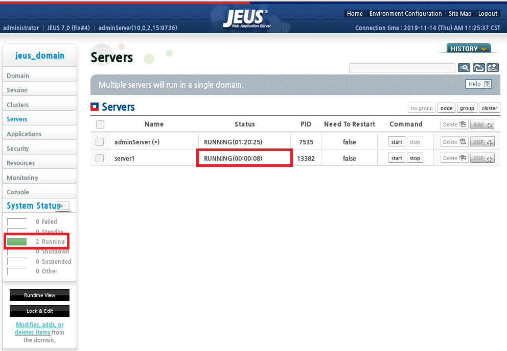

#### 2.13.3 Duplication through the JEUS 7 webadmin
As you saw, JEUS installs __server1__ by default. It is recommended that you install JEUS applications (OFGW, OFMiner, OFManager) on separate servers.
For this installation, we will install 3 additional managed servers: __ofgw_svr__, __ofmgr_svr__ and __ofminer_svr__. Then, we will delete the __server1__.

__a.__ Turn on Edit mode by clicking of "Lock & Edit" button:

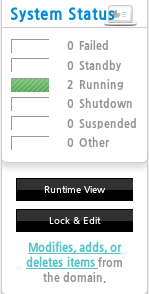

__b.__ Duplicate server1 by clicking "DUP" button:


__c.__ Put node name (ex: ofdemo) and Server name(ex: ofgw_svr), then click "OK" button:

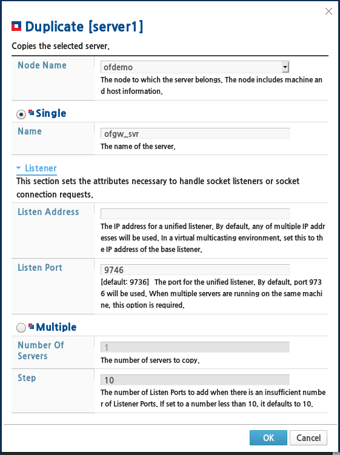

__d.__ Now, server (ofgw_svr) is created. In order to avoid the conflict of port usage, change the port number as follows. In server view, double click target server (ofgw_svr):

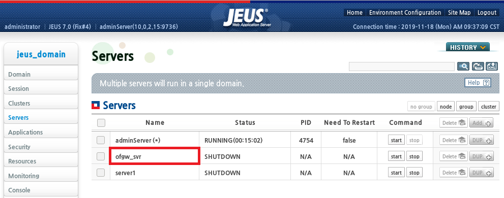

__e.__ Double click __BASE__ and change port number. Repeat changing __HTTP__ and __JMS__ ports (port numbers must be unique for each server, please find all ports numbers in the table below). Apply changes and turn off edit mode by clicking "Apply Changes" button at the end:


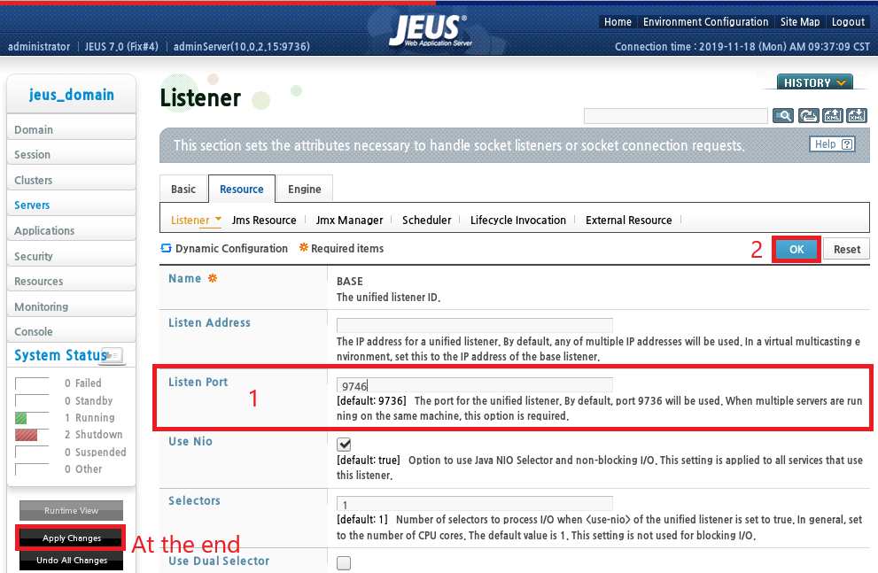

__f.__ In total, you have to create 3 managed servers for OpenFrame. You just need to repeat the duplication process. Their name and parameters are defined below:

| OpenFrame web-solution | Server name | BASE Port | HTTP Port | JMS Internal Port |
|:----------------------:|:-----------:|:---------:|:---------:|:-----------------:|
|   DomainAdmin Server   | adminServer |    9736   |    8808   |        9941       |
|        OFGateway       |   ofgw_svr  |    9746   |    8818   |        9951       |
|        OFManager       |  ofmgr_svr  |    9756   |    8828   |        9961       |
|         OFMiner        | ofminer_svr |    9766   |    8838   |        9971       |


_note: There is also the parameters of the DomainAdminServer to have one tab with all parameters._

__g.__ Servers can be started by command: `startManagedServer -domain jeus_domain -server “server-name” -u administrator -p tmax1234`

__h.__ You can now delete the server called __server1__. Open edit mode with `Lock & Edit`, and hit `delete` for __server1__. Then save changes.

__i.__ Starting here, you should open a new terminal window dedicated to run `htop` to monitor the resources on your machine and check that you do not reach the limit. It is also possible to check the RAM memory usage with the command `cat /proc/meminfo`.

TODO Create a link here to the guide "JEUS" and also "jeusadmin"

#### 2.13.4 Duplication through the jeusadmin console
TODO Section not tested

__a.__ Access the JEUS console and list the servers:
```bash
jeusadmin -u administrator -p tmax1234 -port 9736
# Or just
jeusadmin -u administrator -p tmax1234
# Then
list-servers
```

__b.__ Add managed server (replace 'server-name' and 'baseport' by the appropriate values): `add-server 'server_name'  -addr 10.0.2.15 -baseport 'baseport' -node ofdemo -jvm "-Xmx512m -XX:MaxPermSize=128m"`

_note: For the node, use same as other servers, check with list-servers._

__c.__ Add listener (replace 'server-name' and 'http_port' by the appropriate values): `add-listener -server 'server_name' -name http-server2 -port 'http_port'`

_note: See which port is recommended with the table in the above section._

__d.__ Add HTTP listener (replace 'server-name' by the appropriate value): `add-web-listener -name http2  -server 'server_name' -slref http-server2 -tmin 10`

__e.__ Quit jeusadmin: `quit`	then boot server (replace 'server-name' by the appropriate value): `startManagedServer -domain jeus_domain -server 'server_name' -u administrator -p tmax1234`

TODO What about the jvm port??

_note: In the lines above, change 'http-server2' by 'http-server3' and then 'http-server4'. It has to be unique for each server (check also other values with those numbers, '2' replaced by '3' and then '4')._

## 2.14 Install OFGW

#### 2.14.1 Installation WebTerminal & T3270 Terminal
WebTerminal is the TmaxSoft web product to replace traditional 3270.

__a.__ Confirm the status of JEUS and OFGW servers, they must be up for automatic deployment. First run the command `jeusadmin -u administrator -p tmamx1234` and inside _jeusadmin_ you can run the command `si` or `serverinfo`.

__b.__ Execute the installer:
```bash
# Make sure you still logged in as oframe, if not run the following line first
su - oframe
# <enter password>
cd /opt/tmaxsw
./OpenFrame_GW_7_0_1_Generic.bin
```

Output:
```markdown
   Choose JEUS Folder
   ------------------
   Please Enter JEUS HOME

     Default Install Folder: /home/oframe/jeus7

   ENTER AN ABSOLUTE PATH, OR PRESS <ENTER> TO ACCEPT THE DEFAULT
         : */opt/tmaxui/jeus7*

   INSTALL FOLDER IS: /opt/tmaxui/jeus7
      IS THIS CORRECT? (Y/N): *Y*

   Get Jeus Information
   --------------------
   Please Enter the Domain Name and the Server name
   (Installation Server Folder)

   Jeus Domain Name (DEFAULT: jeus_domain):
   Jeus Server Name (DEFAULT: server1): *ofgw_svr*
   Jeus Administrator Password (DEFAULT: ): *tmax1234*
   Jeus DAS IP (DEFAULT: 10.0.2.15):
   Jeus DAS Base Port (DEFAULT: 9736):

   Get DataBase Information
   ------------------------
   Choose vendor Name of JDBC driver
     ->1- tibero
       2- oracle
       3- mssql
       4- other

   ENTER THE NUMBER FOR YOUR CHOICE, OR PRESS <ENTER> TO ACCEPT THE DEFAULT:
      : *1*

   Get DataBase Information
   ------------------------
   Please Enter Database Information

   DataBase Server Name (DEFAULT: 10.0.2.15):
   DataBase Port (DEFAULT: ): *8629*
   DataBase Name (DEFAULT: TVSAM):
   DataBase User ID (DEFAULT: ): *tibero*
   DataBase User PW (DEFAULT: ): *tmax*

   Get Gateway Information
   -----------------------
   Enter requested information

   Gateway Name (DEFAULT: ofgw):
   Gateway PORT (DEFAULT: 5556): *5477*  <--- Check *osc.properties* from OSC installation, should be the same as the VTAM_PORT
   Datasource ID (DEFAULT: ofgw):
   Application Name (DEFAULT: webterminal):

   Get Tmax Information
   --------------------
   Enter requested information
   ($OPENFRAME_HOME/core/config/oframe.m)

   Tmax NODE Name (DEFAULT: NODE1):
   Tmax NODE IP (DEFAULT: 192.168.220.99): *ofdemo* <--- Use hostname instead of IP address
   Tmax NODE PORT (DEFAULT: 6623):                  <-- echo **$TMAX_HOST_PORT** using oframe user to be sure


   Get OFGW license Path
   ---------------------
   Enter requested information
   ex) /home/user/license/OFGWLicense

   OFGW License Path (DEFAULT: ): */opt/tmaxsw/licenses/OFGWLicense*

   Restart Server
   --------------
   Do you want to restart the server(server1)?
   (To apply the changes, restart the server.)
    -->*1- Yes*
       2- No

   ENTER THE NUMBER OF THE DESIRED CHOICE, OR PRESS <ENTER> TO ACCEPT THE
      DEFAULT: *1*

   [...]

   Installation Complete
   ---------------------

   Congratulations! OpenFrame_GW_7_Fix1 has been successfully installed to:

   /opt/tmaxui/jeus7/domains/jeus_domain/servers/ofgw_svr/lib/application

   Press Done to quit the installer.

   PRESS <ENTER> TO EXIT THE INSTALLER:
```

__c.__ Execute the bash profile and check if the license file is setup correctly:
```bash
. ~/.bash_profile

cd /opt/tmaxui/jeus7/domains/jeus_domain/servers/ofgw_svr/lib/application/ofgwconf/license
ls
# If there is nothing, run one the following commands:
cp /opt/tmaxsw/licenses/OFGWLicense .
# or
ln -s /opt/tmaxsw/licenses/OFGWLicense .
```

__d.__ Tibero 6’s jdbc driver is initially provided. If another version of Tibero or other database is used, copy the corresponding jdbc driver under _/opt/tmaxui/jeus7/lib/datasource_. To have an idea where to find the driver for replacement, the Tibero 6 driver is under _/opt/tmaxdb/tibero6/client/lib/jar/tibero6-jdbc.jar_.

#### 2.14.2 Verification steps
__a.__ Review _install_script.log_ and _OpenFrame_GW_7_Fix1_InstallLog.log_ files:
```bash
cat /opt/tmaxui/jeus7/domains/jeus_domain/servers/ofgw_svr/lib/application/UninstallerData/log/install_script.log
cat /opt/tmaxui/jeus7/domains/jeus_domain/servers/ofgw_svr/lib/application/UninstallerData/log/OpenFrame_GW_7_Fix1_InstallLog.log
```
If you have been provided with logs, check that they are similar to yours.

__b.__ Even if they are supposed to be already up, check the status of the two servers domainAdmin and ofgw_svr:
```bash
jps
# If none of them is running, you can use the following commands (respect the boot order)
startDomainAdminServer -domain jeus_domain -u administrator -p tmax1234
startManagedServer -domain jeus_domain -server ofgw_svr -u administrator -p tmax1234
```

__c.__ Verify if the URL for OFGW is working. Open your browser and type the URL in the address bar in the following format (replace 10.0.2.15 by your IP address): <http://10.0.2.15:8818/webterminal/>


__d.__ Click CONNECT button on top. LU name is automatically assigned. Enter region name: `OSCOIVP1`:

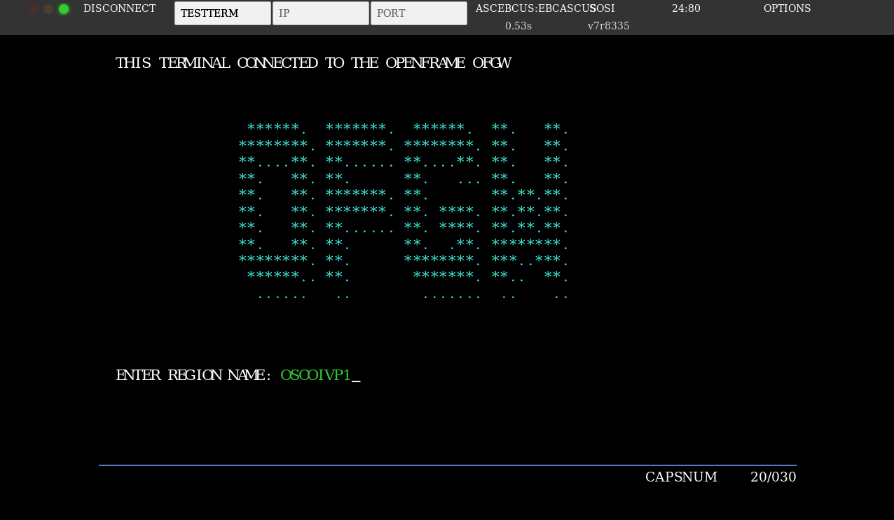

_note: You can check the name of the different regions in /opt/tmaxapp/OpenFrame/osc/region_

TODO Weird screen, it seems there is a glitch don't know why

__e.__ Enter transaction: _OIVP_:

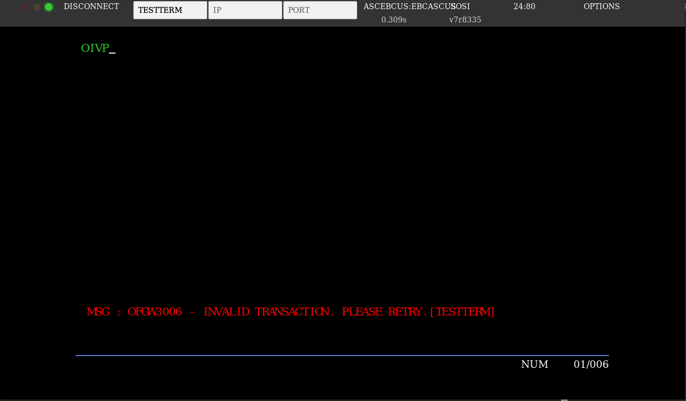

__g.__ Enter code: _BROS_:


TODO Is it normal I have the message "DATA DOES NOT EXIST" on my screen?

## 2.15 Install OFManager

#### 2.15.1 Installation
__a.__ Confirm the status of JEUS and OFManager servers, they must be up for automatic deployment. First run the command `jeusadmin -u administrator -p tmamx1234` and inside _jeusadmin_ you can run the command `si` or `serverinfo`.

__b.__ Execute the installer:
```bash
# Make sure you still logged in as oframe, if not run the following line first
su - oframe
# <enter password>
cd /opt/tmaxsw
./OpenFrame_Manager7_Generic.bin
```

Output:
```markdown
Choose JEUS Folder
------------------
Note
1. OpenFrame Manager7 is available in the JEUS7 Fix4 environment.
2. In order to install OpenFrame Manager7 successfully, Jeus's domainServer and
DataBase must be running.
3. The tablespace to be used by the OpenFrameManager must be created before
install.

Please Enter JEUS HOME

  Default Install Folder: /home/oframe/jeus7

ENTER AN ABSOLUTE PATH, OR PRESS <ENTER> TO ACCEPT THE DEFAULT
      : */opt/tmaxui/jeus7*

INSTALL FOLDER IS: /opt/tmaxui/jeus7
   IS THIS CORRECT? (Y/N): *Y*

Get Jeus Information
--------------------
Plase Enter the DomainAdminServer Name and the ManagedServer name
(Installation Server Folder)

JEUS DomainAdminServer Name (DEFAULT: jeus_domain):

JEUS ManagedServer Name (DEFAULT: server1): *ofmgr_svr*

JEUS DomainAdminServer Password (DEFAULT: ): *tmax1234*

JEUS DomainAdminServer IP (DEFAULT: 10.0.2.15): *ofdemo*

JEUS DomainAdminServer Base Port (DEFAULT: 9736):


Get DataBase Information
------------------------
Choose vendor Name of JDBC driver

  ->1- Tibero
    2- Oracle
    3- MS-SQL
    4- others

ENTER THE NUMBER FOR YOUR CHOICE, OR PRESS <ENTER> TO ACCEPT THE DEFAULT:
   : *1*

Get DataBase Information
------------------------
Please Enter Database Information

DataBase Server Name (DEFAULT: 10.0.2.15): *ofdemo*

DataBase Port (DEFAULT: ): *8629*

DataBase Name (DEFAULT: TVSAM):

DataBase User ID (DEFAULT: ): *tibero*

DataBase User PW (DEFAULT: ): *tmax*


Get OpenFrameManager Information
--------------------------------
Enter requested information

Datasource ID (DEFAULT: ds_ofm1):

Application Name (DEFAULT: ofmanager):

TABLESPACE Name (DEFAULT: OFMGR01): *DEFVOL*


Check the module to use.
------------------------
Check all the modules you want to use in the OpenFrameManager.
(Common modules are set by default.)

  ->1- Batch Manager (BM)
  ->2- TACF Manager (TM)
  ->3- Online Manager (OM)

ENTER A COMMA-SEPARATED LIST OF NUMBERS REPRESENTING THE DESIRED CHOICES, OR
   PRESS <ENTER> TO ACCEPT THE DEFAULT: *1,2,3*


Get OnlineManager Information
-----------------------------
Enter requested information

Webterminal IP (DEFAULT: ofdemo):

Webtermianl Application Name (DEFAULT: webterminal):

OFGW LU PORT (DEFAULT: 5556): *5477*

OFGW Name (DEFAULT: ofgw):


Get Tmax Information
--------------------
Enter requested information
($OPENFRAME_HOME/core/config/oframe.m)

Tmax NODE IP (DEFAULT: 10.0.2.15): *ofdemo*

Tmax NODE PORT (DEFAULT: 6623):


Get OFManager license Path
--------------------------
Enter requested information
ex) /home/user/license/OFManagerLicense

OFManager License Path (DEFAULT: ): */opt/tmaxsw/licenses/OFManagerLicense*


Restart ManagedServer
---------------------
Do you want to restart the server(ofmgr_svr)?
(To apply the changes, restart the server.)

  ->1- Yes
    2- No

ENTER THE NUMBER OF THE DESIRED CHOICE, OR PRESS <ENTER> TO ACCEPT THE
   DEFAULT: *1*

[...]

Disk Space Information (for Installation Target):
    Required:  60,097,348 bytes
    Available: 41,000,345,600 bytes

[...]

Installation Complete
---------------------
Congratulations! OpenFrame_Manager7 has been successfully installed to:

     /opt/tmaxui/jeus7/domains/jeus_domain/servers/ofmgr_svr/lib/application/of
manager

Press Done to quit the installer.

PRESS <ENTER> TO EXIT THE INSTALLER:
```

__c.__ Execute the bash profile and check the if license file is setup correctly:
```bash
. ~/.bash_profile

cd /opt/tmaxui/jeus7/domains/jeus_domain/servers/ofmgr_svr/lib/application/ofmanager/license
ls
# If there is nothing, run one the following commands:
cp /opt/tmaxsw/licenses/OFManagerLicense .
# or
ln -s /opt/tmaxsw/licenses/OFManagerLicense .
```

#### 2.15.2 Verification steps
__a.__ Review _install_script.log_ and _OpenFrame_Manager7_InstallLog.log_ files:
```bash
cat /opt/tmaxui/jeus7/domains/jeus_domain/servers/ofmgr_svr/lib/application/ofmanager/UninstallerData/log/install_script.log
cat /opt/tmaxui/jeus7/domains/jeus_domain/servers/ofmgr_svr/lib/application/ofmanager/UninstallerData/log/OpenFrame_Manager7_InstallLog.log
```
If you have been provided with logs, check that they are similar to yours.

__b.__ Even if they are supposed to be already up, check the status of the two servers domainAdmin and ofmgr_svr:
```bash
jps
# If none of them is running, you can use the following commands (respect the boot order)
startDomainAdminServer -domain jeus_domain -u administrator -p tmax1234
startManagedServer -domain jeus_domain -server ofmgr_svr -u administrator -p tmax1234
```

__c.__ Verify if the URL for OFManager is working. Open your browser and type the URL in the address bar in the following format (replace 10.0.2.15 by your IP address): <http://10.0.2.15:8828/ofmanager/>. The credentials for the login page are `ROOT` and `SYS1`.

## 2.16 Install OFMiner

#### 2.16.1 Installation
__a.__ Confirm the status of JEUS and OFMiner servers, they must be up for automatic deployment. First run the command `jeusadmin -u administrator -p tmamx1234` and inside _jeusadmin_ you can run the command `si` or `serverinfo`.

__b.__ Execute the installer:
```bash
# Make sure you still logged in as oframe, if not run the following line first
su - oframe

cd /opt/tmaxsw
./OpenFrame_Miner_7_Fix1_Generic.bin
```

Output:
```markdown   
   Choose Install Folder
   ---------------------
   Where would you like to install?

   Default Install Folder: /home/oframe/OFMiner

   ENTER AN ABSOLUTE PATH, OR PRESS <ENTER> TO ACCEPT THE DEFAULT
         : */opt/tmaxui/ofminer*

   INSTALL FOLDER IS: /opt/tmaxui/ofminer
      IS THIS CORRECT? (Y/N): *Y*

   Get Jeus Infomation
   -------------------
   Please Enter the Domain Name and the Server name
   (Installation Server Folder)

   Jeus Server Name (DEFAULT: server1): *ofminer_svr*
   Jeus Administrator PW (DEFAULT: ): *tmax1234*
   Jeus PORT (DEFAULT: ): *9736*

   Get DataBase Infomation
   -----------------------
   Enter requested information

   DataBase IP (DEFAULT: 10.0.2.15):
   DataBase PORT (DEFAULT: 8629):
   DataBase NAME (DEFAULT: TVSAM):
   DataBase User ID (DEFAULT: tibero):
   DataBase User PW (DEFAULT: tmax):

   Choose OS
   ---------
   Enter requested information
   ex) mvs,xsp

   OFMiner OS (DEFAULT: mvs):


   Get OFMiner license Path
   ------------------------
   Enter requested information
   ex) /home/user1/license/OFMinerLicense

   OFMiner License Path (DEFAULT: ): */opt/tmaxsw/licenses/OFMinerLicense*

   [...]

   Installation Complete
   ---------------------
   Congratulations! OpenFrame_Miner_7_Fix1 has been successfully installed to:

   /opt/tmaxui/ofminer

   Press Done to quit the installer.

   PRESS <ENTER> TO EXIT THE INSTALLER:
```

__c.__ Execute the bash profile and check if the license file is setup correctly:
```bash
. ~/.bash_profile

cd /opt/tmaxui/ofminer/license
ls
# If there is nothing, run one the following commands:
cp /opt/tmaxsw/licenses/OFMinerLicense .
# or
ln -s /opt/tmaxsw/licenses/OFMinerLicense .
```

#### 2.16.2 Verification steps
__a.__ Review _install_script.log_ and _OpenFrame_Miner_7_Fix1_InstallLog.log_ files:
```bash
cat /opt/tmaxui/ofminer/UninstallerData/log/install_script.log
cat /opt/tmaxui/ofminer/UninstallerData/log/OpenFrame_Miner_7_Fix1_InstallLog.log
```
If you have been provided with logs, check that they are similar to yours.

__b.__ Even if they are supposed to be already up, check the status of the two servers domainAdmin and ofminer_svr:
```bash
jps
# If none of them is running, you can use the following commands (respect the boot order)
startDomainAdminServer -domain jeus_domain -u administrator -p tmax1234
startManagedServer -domain jeus_domain -server ofminer_svr -u administrator -p tmax1234
```

__c.__ Verify if the URL for OFMiner is working. Open your browser and type the URL in the address bar in the following format (replace 10.0.2.15 by your IP address): <http://10.0.2.15:8838/ofminer/>> The credentials for the login page are `ROOT` and `SYS1`.

## 2.17 Install HiDB (IMS DB)

#### 2.17.1 Installation
__a.__ Make sure OSC is down with the command `oscdown` and Tibero is up with the command `ps -ef | grep tbsvr`. If not, run as oftibr user `tbboot` first.

__b.__ Check and edit the following parameters in hidb.properties (_/opt/tmaxsw/hidb.properties_) file:
```text
OPENFRAME_HOME=/opt/tmaxapp/OpenFrame
DEFAULT_VOLSER=DEFVOL
HIDB_TABLESPACE=DEFVOL
DATABASE=TVSAM
USERNAME=tibero
PASSWORD=tmax
LIB_CREATE=YES
HIDB_OBJECT_DIR=/opt/tmaxapp/OpenFrame/hidb/hidb_sch
HIDB_IMPORT_DIR=/opt/tmaxapp/OpenFrame/hidb/hidb_import
COPYBOOK_DIR=/opt/tmaxapp/OpenFrame/hidb/hidb_cpy

IMS_DBDLIB=IMS.DBDLIB
IMS_PSBLIB=IMS.PSBLIB
IMS_RESLIB=IMS.RESLIB
IMS_ACBLIB=IMS.ACBLIB

OPENFRAME_LICENSE_PATH=/opt/tmaxsw/licenses/openframe
```

__c.__ Execute the installer using the properties file and then the bash profile:
```bash
cd /opt/tmaxsw
./OpenFrame_HIDB7_1_Linux_x86_64.bin -f hidb.properties
```

__d.__ Check if the license file is setup correctly:
```bash
cd /opt/tmaxapp/OpenFrame/license
ls
# If the lichidb.dat is missing, run one the following commands:
cp /opt/tmaxsw/licenses/openframe/lichidb.dat .
# or
ln -s /opt/tmaxsw/licenses/openframe/lichidb.dat .
```

#### 2.17.2 Verification steps
__a.__ Check the _install_hidb.log_ and the _OpenFrame_HiDB7_1_InstallLog.log_ files:
```bash
cd $OPENFRAME_HOME/UninstallerData/log
vi install_hidb.log
vi OpenFrame_HiDB7_1_InstallLog.log
```
If you have been provided with logs, check that they are similar to yours.

## 2.18 Install OSI Online (IMS DC)

#### 2.18.1 Installation

__a.__ Make sure OSC is down with the command `oscdown` and Tibero is up with the command `ps -ef | grep tbsvr`. If not, run as oftibr user `tbboot` first.

__b.__ Check and edit the following parameters in osi.properties (_/opt/tmaxsw/osi.properties_) file:
```text
OPENFRAME_HOME=/opt/tmaxapp/OpenFrame
DEFAULT_VOLSER=DEFVOL
DEFAULT_VOLPATH=/opt/tmaxapp/OpenFrame/volume_default
COMPILER_TYPE=OFCOBOL

IMSA_JCLLIB=SYS1.JCLLIB

OSI_LICENSE_PATH=/opt/tmaxsw/licenses/openframe

TSAM_USERNAME=tibero
TSAM_PASSWORD=tmax
TSAM_DATABASE=TVSAM

VTAM_SHMKEY=85222
VTAM_DSNAME=OSI.IMSA.VTAMLST

VTAM_GW_PORT=5477

IMSA_SHMKEY=86222

IMSA_MODBLKS=OSI.IMSA.DEFLIB
IMSA_IMSACB=IMS.ACBLIB
IMSA_DFSRELB=IMS.RESLIB
IMSA_MATRIX=OSI.IMSA.SECLIB
IMSA_FORMAT=OSI.IMSA.MFSLIB
IMSA_STEPLIB=OSI.IMSA.STEPLIB

IMSA_MQLIB=OSI.IMSA.MQLIB
```

__c.__ Execute the installer using the properties file and then the bash profile:
```bash
cd /opt/tmaxsw
./OpenFrame_OSI7_1_Linux_x86_64.bin -f osi.properties
```

__d.__ Check if the license file is setup correctly:
```bash
cd /opt/tmaxapp/OpenFrame/license
ls
# If the licosi.dat is missing, run one the following commands:
cp /opt/tmaxsw/licenses/openframe/licosi.dat .
# or
ln -s /opt/tmaxsw/licenses/openframe/licosi.dat .
```

#### 2.18.2 Verification steps
__a.__ Check the _install_OSI.log_ and the _OpenFrame_OSI7_1_InstallLog.log_ files:
```bash
cd $OPENFRAME_HOME/UninstallerData/log
vi install_OSI.log
vi OpenFrame_OSI7_1_InstallLog.log
```
If you have been provided with logs, check that they are similar to yours.

TODO Add some steps here to verify that OSI is properly working

## 2.19 OFStudio

#### 2.19.1 Server Installation
__c.__ Execute the installer:
```bash
cd /opt/tmaxsw
./OpenFrame_Studio7_Linux_X86_64.bin
# TODO Is it necessary?
. ~/.bash_profile
```

Output:
```markdown
Get OpenFrame PATH
------------------
Please enter the OpenFrame Home information to install OpenFrame Studio7 Server binary.
($OPENFRAME_HOME)

OpenFrame Home Path (DEFAULT: /opt/tmaxapp/OpenFrame):


Get TMAX Info
-------------
Please enter the name of the Tmax Info to configure the OpenFrame Studio7 Server.

TMAX Node name (DEFAULT: NODE1):

TMAX ConfigFile name (DEFAULT: oframe.m):


OFGDB installation path
-----------------------
Please enter the path to install OFGDB ($OFGDB_HOME)

OFGDB installation path (DEFAULT: /home/oframe/OFGDB): */opt/tmaxapp/OFGDB*

[...]

Disk Space Information (for Installation Target):
    Required:  91,793,850 bytes
    Available: 40,164,904,960 bytes

[...]

Installation Complete
---------------------
Congratulations. OpenFrame_Studio7_Server has been successfully installed

PRESS <ENTER> TO EXIT THE INSTALLER:
```

TODO Copy of the license

#### 2.19.2 Verification steps
TODO Add some steps here to verify that OpenFrame Studio is properly working

#### 2.19.3 Client Installation
TODO Fill this section

## 2.20 Running additional scripts
TODO Section not tested

Run the following script to enhance your use of OpenFrame products:
- scripts_folder_generation.sh
- jeus_add_commands.sh (under jeus7/bin)

# 3. Boot/shutdown process
TODO Section not tested

## 3.1 Boot everything
__a.__ Launch Tibero first:
```bash
su -  oftibr
# <enter password>
tbboot
```

__b.__ Then you can log in as oframe user in another terminal to boot all other components:
```bash
su – oframe
# <enter password>
osctdlinit OSCOIVP1
oscboot

# Only if you installed OSI
osiboot -g
tjesmgr boot
tjesmgr r IMSACTL
imscmd IMSA /NRE
imscmd IMSA /START DC
imscmd IMSA /START REGION IMSAMSG

# JEUS (required)
startDomainAdminSerrver -domain jeus_domain -u administrator -p tmamx1234
startManagedServer -server ofgw_svr -u administrator -p tmax1234
startManagedServer -server ofmgr_svr -u administrator -p tmax1234
startManagedServer -server ofminer_svr -u administrator -p tmax1234
```

## 3.2 Shutdown everything
__a.__ Down everything as oframe user first:
```bash
su – oframe
# <enter password>

stopServer -host 10.0.2.15:8838 -u administrator -p tmax1234
stopServer -host 10.0.2.15:8828 -u administrator -p tmax1234
stopServer -host 10.0.2.15:8818 -u administrator -p tmax1234
jeusadmin -u administrator -p tmax1234 local-shutdown

imscmd IMSA /CHE FREEZE
osidown -g

oscdown
```

__b.__ Then down Tibero in another terminal:
```bash
su – oftibr
# <enter password>
tbdown
```
