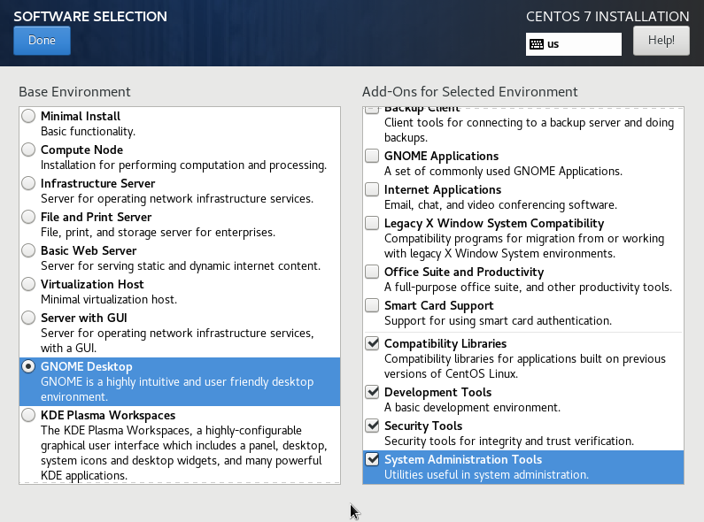
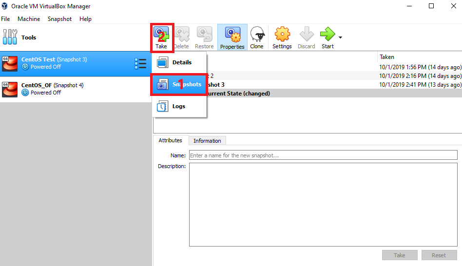
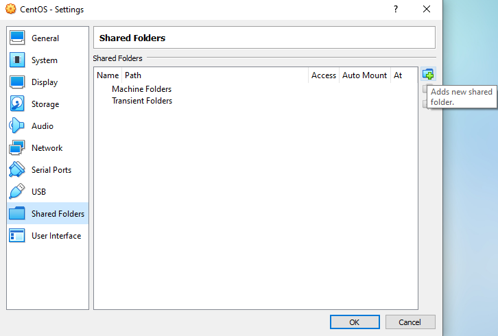

# Installation Package 1

Keywords: Windows10, CentOS7, VirtualBox, OpenFrame7, ofdemo

## 1. Version List
- Tibero Version 6 Fix 6
- OpenFrame BASE, BATCH, OSC, OSI, TACF Version 7 Fix 3
- OpenFrame COBOL Compiler 4 Revision : 472
- OpenFrame PL/I Compiler 3 Revision: 427 CommitID: 6ca0580PROSORT Version 3
- JEUS Version 7 Fix 4
- OFManager Version 7, OFMiner Version 7 Fix 1, OFGW Version 7 Fix 1

## 2. File List
- base.properties
- batch.properties
- tacf.properties
- osc.properties
- osi.properties
- hidb.properties
- compile.sh
- dbclear.sh
- unixODBC-2.3.4.tar.gz
- tibero6-bin-FS06_CS_1806-linux64-158667-opt-20180912120346-tested.tar.gz
- OpenFrame_Base7_Fix3_Linux_x86_64.bin
- OpenFrame_Batch7_Fix3_MVS_Linux_x86_64.bin
- OpenFrame_Tacf7_Fix3_Linux_x86_64.bin
- prosort-bin-prosort_2sp3-linux64-2167-opt.tar.gz
- OpenFrame_COBOL4_472_Linux_x86_64.bin
- OpenFrame_PLI3_427_Linux_x86_64.bin
- OpenFrame_ASM4_525_Linux_x86_64.bin
- ProTrieve2_1_Linux_x86_64.bin
- OpenFrame_OSC7_Fix3_Linux_x86_64.bin
- apache-ant-1.9.14-bin.tar.gz
- jeus704.tar.gz
- OpenFrame_GW_7_0_1_Generic.bin
- OpenFrame_Miner_7_Fix1_Generic.bin
- OpenFrame_Manager7_Generic.bin
- OpenFrame_HiDB7_1_Linux_x86_64.bin
- OpenFrame_OSI7_1_Linux_x86_64.bin
- OpenFrame_Studio7_Linux_X86_64.bin
- OpenFrameStudio7_Client_Win64.exe

TODO I don't know if these files are necessary or not:
- OFCOBOL-4.0.601-x86_64.tar.gz
- tibero.cfg

_Optional scripts_:
- .bash_profile for oframe user
- .bash_profile for oftibr user
- TODO probably others

## 3. Operating System Characteristics
4 commands required to have as much information as possible on the OS:
```bash
uname -a
cat /proc/cpuinfo
cat /etc/*-release
file /bin/ps
```

The results of these four commands are:
```shell
Linux localhost.localdomain 3.10.0-1062.4.1.el7.x86_64 #1 SMP Fri Oct 18 17:15:30 UTC 2019 x86_64 x86_64 x86_64 GNU/Linux
```

```shell
processor	: 0
vendor_id	: GenuineIntel
cpu family	: 6
model		: 158
model name	: Intel(R) Core(TM) i7-8850H CPU @ 2.60GHz
stepping	: 10
cpu MHz		: 2592.002
cache size	: 9216 KB
physical id	: 0
siblings	: 4
core id		: 0
cpu cores	: 4
apicid		: 0
initial apicid	: 0
fpu		: yes
fpu_exception	: yes
cpuid level	: 22
wp		: yes
flags		: fpu vme de pse tsc msr pae mce cx8 apic sep mtrr pge mca cmov pat pse36 clflush mmx fxsr sse sse2 ht syscall nx rdtscp lm constant_tsc rep_good nopl xtopology nonstop_tsc eagerfpu pni pclmulqdq ssse3 cx16 pcid sse4_1 sse4_2 x2apic movbe popcnt aes xsave avx rdrand hypervisor lahf_lm abm 3dnowprefetch invpcid_single fsgsbase avx2 invpcid rdseed clflushopt flush_l1d
bogomips	: 5184.00
clflush size	: 64
cache_alignment	: 64
address sizes	: 39 bits physical, 48 bits virtual
power management:

processor	: 1
vendor_id	: GenuineIntel
cpu family	: 6
model		: 158
model name	: Intel(R) Core(TM) i7-8850H CPU @ 2.60GHz
stepping	: 10
cpu MHz		: 2592.002
cache size	: 9216 KB
physical id	: 0
siblings	: 4
core id		: 1
cpu cores	: 4
apicid		: 1
initial apicid	: 1
fpu		: yes
fpu_exception	: yes
cpuid level	: 22
wp		: yes
flags		: fpu vme de pse tsc msr pae mce cx8 apic sep mtrr pge mca cmov pat pse36 clflush mmx fxsr sse sse2 ht syscall nx rdtscp lm constant_tsc rep_good nopl xtopology nonstop_tsc eagerfpu pni pclmulqdq ssse3 cx16 pcid sse4_1 sse4_2 x2apic movbe popcnt aes xsave avx rdrand hypervisor lahf_lm abm 3dnowprefetch invpcid_single fsgsbase avx2 invpcid rdseed clflushopt flush_l1d
bogomips	: 5184.00
clflush size	: 64
cache_alignment	: 64
address sizes	: 39 bits physical, 48 bits virtual
power management:

processor	: 2
vendor_id	: GenuineIntel
cpu family	: 6
model		: 158
model name	: Intel(R) Core(TM) i7-8850H CPU @ 2.60GHz
stepping	: 10
cpu MHz		: 2592.002
cache size	: 9216 KB
physical id	: 0
siblings	: 4
core id		: 2
cpu cores	: 4
apicid		: 2
initial apicid	: 2
fpu		: yes
fpu_exception	: yes
cpuid level	: 22
wp		: yes
flags		: fpu vme de pse tsc msr pae mce cx8 apic sep mtrr pge mca cmov pat pse36 clflush mmx fxsr sse sse2 ht syscall nx rdtscp lm constant_tsc rep_good nopl xtopology nonstop_tsc eagerfpu pni pclmulqdq ssse3 cx16 pcid sse4_1 sse4_2 x2apic movbe popcnt aes xsave avx rdrand hypervisor lahf_lm abm 3dnowprefetch invpcid_single fsgsbase avx2 invpcid rdseed clflushopt flush_l1d
bogomips	: 5184.00
clflush size	: 64
cache_alignment	: 64
address sizes	: 39 bits physical, 48 bits virtual
power management:

processor	: 3
vendor_id	: GenuineIntel
cpu family	: 6
model		: 158
model name	: Intel(R) Core(TM) i7-8850H CPU @ 2.60GHz
stepping	: 10
cpu MHz		: 2592.002
cache size	: 9216 KB
physical id	: 0
siblings	: 4
core id		: 3
cpu cores	: 4
apicid		: 3
initial apicid	: 3
fpu		: yes
fpu_exception	: yes
cpuid level	: 22
wp		: yes
flags		: fpu vme de pse tsc msr pae mce cx8 apic sep mtrr pge mca cmov pat pse36 clflush mmx fxsr sse sse2 ht syscall nx rdtscp lm constant_tsc rep_good nopl xtopology nonstop_tsc eagerfpu pni pclmulqdq ssse3 cx16 pcid sse4_1 sse4_2 x2apic movbe popcnt aes xsave avx rdrand hypervisor lahf_lm abm 3dnowprefetch invpcid_single fsgsbase avx2 invpcid rdseed clflushopt flush_l1d
bogomips	: 5184.00
clflush size	: 64
cache_alignment	: 64
address sizes	: 39 bits physical, 48 bits virtual
power management:
```

```shell
CentOS Linux release 7.7.1908 (Core)
NAME="CentOS Linux"
VERSION="7 (Core)"
ID="centos"
ID_LIKE="rhel fedora"
VERSION_ID="7"
PRETTY_NAME="CentOS Linux 7 (Core)"
ANSI_COLOR="0;31"
CPE_NAME="cpe:/o:centos:centos:7"
HOME_URL="https://www.centos.org/"
BUG_REPORT_URL="https://bugs.centos.org/"

CENTOS_MANTISBT_PROJECT="CentOS-7"
CENTOS_MANTISBT_PROJECT_VERSION="7"
REDHAT_SUPPORT_PRODUCT="centos"
REDHAT_SUPPORT_PRODUCT_VERSION="7"

CentOS Linux release 7.7.1908 (Core)
CentOS Linux release 7.7.1908 (Core)
```

```shell
/bin/ps: ELF 64-bit LSB executable, x86-64, version 1 (SYSV), dynamically linked (uses shared libs), for GNU/Linux 2.6.32, BuildID[sha1]=7355700090b47498a077aac37f2c5a2271dd627d, stripped
```

Other useful characteristics:
- Kernel version: 1062.
- 8GB RAM, 4 virtual CPUs
  
TODO maybe 6 CPU is better (change the licenses accordingly)

_note: There is a minimum of 2 CPUs for the virtual machine, but at least 4 for OpenFrame installation. You can put as many as you want in order to have a more efficient and smooth machine. This number is significant because it also determines some of the parameters of certain licenses when requested._

## 4. Hardware
HP ProBook 650 G4:
 - Processor: Intel(R) Core i7-8850H CPU @ 2.60GHz, 6 Cores
 - Installed RAM: 16.0GB
 - System type: 64-bit operating system, x64-based processor

## 5. Software requirements
 - Host: Windows 10 Pro
 - VirtualBox: 6.0.12 build 133076 (+ Extension Pack for VirtualBox 6.0.12)
 - Guest: CentOS 7 x86_64 1908 (kernel 1062)

Find all the files required for the following installation in the archive VM_setup_installation_package_1.zip.

## 6. Virtual machine requirements
- Core: 4 virtual CPUs (Min)
- Memory: 8 GB (Min)
- virtual drive: 64 GB (Min), recommended to be dynamically allocated to not occupy too much space at the beginning

## 6. Additional information

### 6.1 Installation process
- __CentOS installation__: select the installation with the GNOME Desktop and all the following tools: Compatibility Libraries, Development Tools, Security Tools, System Administration Tools. Moreover, during the installation process you have to create the normal user and the root user. Please choose carefully the passwords (you can use `tmax1234` for the password to use the same during the whole process of installation).




- __Additional packages installed__ (necessary for the Guest Additions installation):
 ```bash
 yum -y update
 yum -y install epel-release
 yum -y install make gcc kernel-headers kernel-devel perl dkms bzip2
 ```

 - __Guest Additions__: 6.0.13 revision 133546 (the actual build with the installation of VirtualBox was not working, version found on the VirtualBox test builds page)
   <https://www.virtualbox.org/wiki/Testbuilds>

If the Guest Additions available in your VirtualBox buid works, do the following steps:

- Open the drop down meu __Devices__ of your VM, then go to __Insert Guest Additons CD image...__
  
  TODO Add the corresponding screeshot

- Click on the disk that appear on the CentOS Desktop

TODO Add the corresponding screeshot

- Click on __Run Software__ on the top right corner

TODO Add the corresponding screeshot

To install another Guest Additions than the one available in your VirtualBox buid, do the following steps:

- Open the drop down meu __Devices__ of your VM, then __Optical Drives__ and __Choose disk image...__

TODO Add the corresponding screeshot

- Open the Guest Additions ISO you want to install
- Click on the disk that appear on the CentOS Desktop
- Click on __Run Software__ on the top right corner

Verification steps:
- You should be able to resize the window
- You should be able to activate the shared clipboard
- Your mouse and keyboard are no longer captured
- There is a folder _VBoxGuestAdditions-6.0.13_ under _/opt_

Reboot and that is it, you are ready for OpenFrame installation. Take a screenshot of your virtual machine in case you need to go back to this clean state. To do it, follow the steps on the following screenshot. You can give a name to the screenshot and provide a description according the state of the VM.



_note: In order to go faster on these first steps it is possible to provide an OVA file (exported file from a virtual machine) to be easily imported. See the following screenshots:_


TODO If we use this ova file to make an installation really fast, we have to ensure that the PC where we export the file and the PC where we install the virtual machine are not necessarily the same.

### 6.2 How to transfer file(s) to a Virtual Machine
One of the solutions to transfer files is to set up a shared folder between host and guest. Make sure you had no issues for the Guest Additions installation process, this is a required step for this folder. The configuration of the folder can be performed regardless of the state of the virtual machine, on or off. Here, the machine is on.

- Go to the menu _Devices_ and _Shared Folder Settings..._:

 Shared Folder Settings...">

- Then click on _Add new shared folder_:



- Select a folder in the host machine to be shared with the guest. Add the _Auto-mount_ value. It is optional but you can make the shared folder permanent:


- Now you can see that you have a new folder available on the guest machine desktop:


- You can also access it through the terminal with root access under _/media_:


